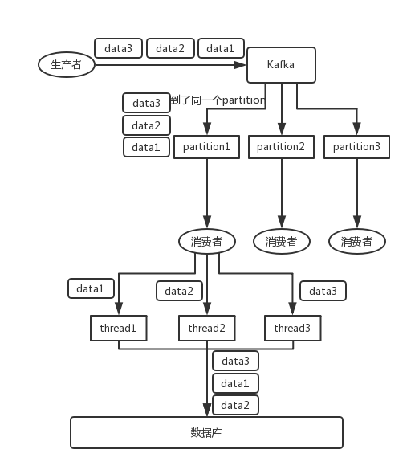
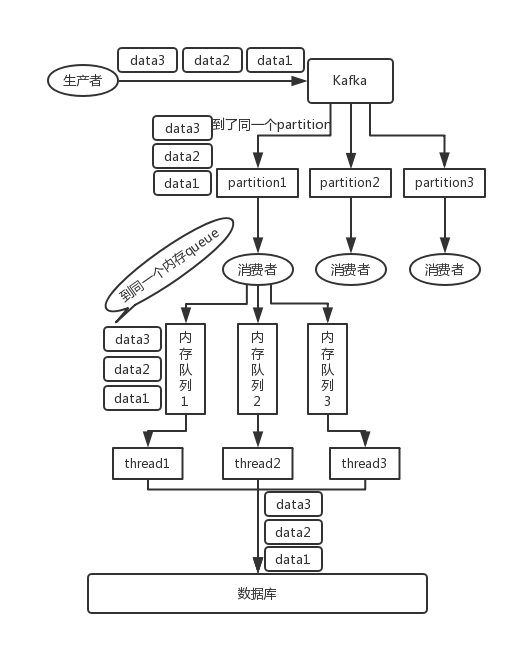
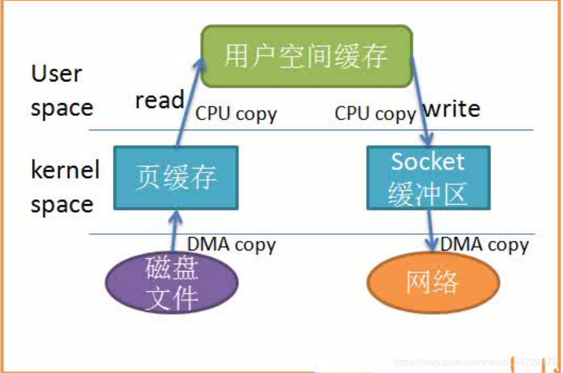
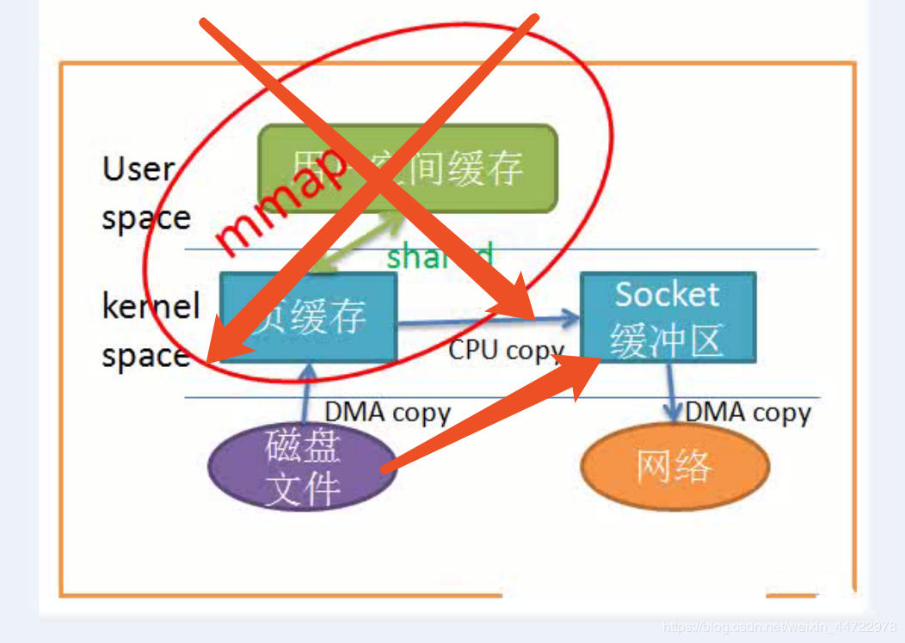

# kafka 如何保证消息顺序性？
MQ应当要保证消息先进先出的特点，但一般情况下使用kafka不能保证消息的顺序性，首先说为啥kafka通常情况下不能保证消息的顺序性吧。

一般topic会有多个partition，这样能提升系统的吞吐量。而一个consumer可以读多个partition上的消息，这样的话就不能保证消息的顺序性了。
一个topic，一个partition，一个consumer是能保证消息的顺序性的，但一般没人这么做。

保证消息顺序性可以这样做：给每一类消息给定一个key，这个key给kafka对消息进行rebalance，这样一同一个key的消息都被发送到了一个partition，因此能保证消息的顺序性。

但是单个consumer线程消费消息的吞吐量也很低，我们可以在本地搞一个内存队列，具有相同key的消息存放到一个内存队列里面，每个线程消费一个内存队列。既能保证顺序也能保证吞吐率。

# kafka为什么吞吐量高？
1. 顺序写的形式存储数据
2. 生产者和消费者都支持批量处理
3. 数据零拷贝的支持
4. topic的分区（partition）存放
5. 内部对数据进行压缩，减少带宽传输

# 什么是数据零拷贝？两张图解释。

# kafka 中的 ISR 和 AR 代表什么？ISR 伸缩性指什么？
ISR:In-Sync Replicas 副本同步队列（每个patition都有一个）
AR:Assigned Replicas 所有副本
ISR是由leader维护，follower从leader同步数据有一些延迟（包括延迟时间replica.lag.time.max.ms和延迟条数replica.lag.max.messages两个维度, 当前最新的版本0.10.x中只支持replica.lag.time.max.ms这个维度），任意一个超过阈值都会把follower剔除出ISR, 存入OSR（Outof-Sync Replicas）列表，新加入的follower也会先存放在OSR中。AR=ISR+OSR。

# kafka 的 producer 发送数据后，接收到的 ack 的 -1, 0, 1 的时候代表什么？
1. 1(默认) 数据发送到kafka后，leader接收到了，就算发送成功了。这种情况下可能会由于leader宕机导致数据丢失。
2. 0 生产者发送数据后就不管了，不去等待任何返回。这种情况效率最高，但是可靠性很低。
3. -1 producer发送后需要等待所有在ISR中的所有follower都返回才算发送完成，可靠性最高。当ISR中所有Replica都向Leader发送ACK时，leader才commit，这时候producer才能认为一个请求中的消息都commit了。

# 如果leader crash时，ISR为空怎么办？
kafka在Broker端提供了一个配置参数：unclean.leader.election,这个参数有两个值：
true（默认）：允许不同步副本成为leader，由于不同步副本的消息较为滞后，此时成为leader，可能会出现消息不一致的情况。
false：不允许不同步副本成为leader，此时如果发生ISR列表为空，会一直等待旧leader恢复，降低了可用性。

# 如何保证消息不丢？
从两个方面着手：消息发送和消息消费。
消息发送：默认是同步方式，可通过producer.type属性进行配置；确认机制为设置request.required.acks=-1
消息消费：自己写事物完全控制offset的管理。

# 如何保证消息不被重复消费？（如何保证消息消费时的幂等性？）
将消息的唯一标识保存到外部介质中，每次消费时判断是否处理过即可。

# 消费者提交消费位移时提交的是当前消费到的最新消息的offset还是offset+1?
offset+1，代表下次从offset+1开始消费

