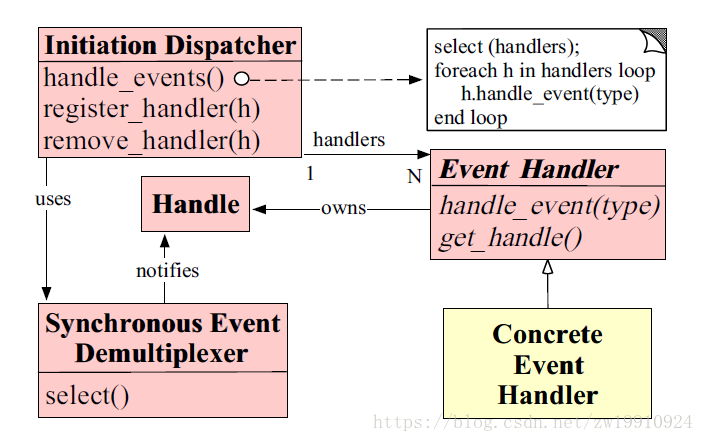

# Netty 

* 本质：网络应用程序框架
* 实现：异步、事件驱动
* 特性：高性能、可维护、快速开发
* 用途：开发服务器和客户端

## Netty 的前尘往事

归属上来看，netty 4.0版本之前归属于 JBoss，后面归属于 Netty 社区。

为什么废弃5.0？
* 复杂
* 没有证明明显的性能趋势
* 维护不过来
 
## Netty 怎么切换三种IO?

### 什么是经典的三种 I/O 模式？
* BIO(阻塞I/O) JDK1.4之前
* NIO(非阻塞I/O) JDK1.4(2002年，java.nio包)
* AIO(异步I/O) JDK1.7(2011年)
 
### Netty 对三种 I/O 模式的支持

* Deprecated BIO
* Removed AIO
* NIO
    * COMMON
    * Linux
    * macOS

### 为什么 Netty 仅支持 NIO了？
为什么不建议（deprecate）阻塞 I/O (BIO/OIO)?
连接数较高的情况下：阻塞 -> 耗资源、效率低

为什么删掉已经做好的AIO支持？
* windows 实现成熟，但是很少用来做服务器
* Linux 常用来做服务器，但是 AIO 实现不够成熟
* Linux 下 AIO 相比较 NIO 的性能提升不明显

### 为什么 Netty 有多种 NIO 实现？
通用的 NIO 实现（COMMON）在 Linux 下也是使用 epoll，为什么自己单独实现？

实现的更好！
* Netty 暴露了更多的可控参数，例如：
    * JDK 的 NIO 默认实现是水平触发
    * Netty 是边缘触发（默认）和水平触发可切换
* Netty 实现的垃圾回收更少、性能更好

### NIO 一定优于 BIO 么？

## Reactor 模式
reactor模式翻译过来叫做反应器模式，通常我们都直接叫做reactor模式。

reactor模式是一种事件驱动模式，用于处理一个或者多个客户端发过来的请求，服务端会有一个处理器对到来的请求进行分离，并且将这些请求分发给对应的请求处理器进行处理。reactor的结构图大概如下图所示：

从上面的结构图可以看出，Reactor模式由五中角色构成。分别是Handle（句柄或者描述符）、Synchronous Event Demultiplexer（同步事件分离器）、Event Handler（事件处理器）、Concrete Event Handler（具体事件处理器）、Initiation Dispatcher（初始分发器）。
* **Handle（句柄或者描述符）**：本质上表示一种资源，是由操作系统提供的；该资源用于表示一个个事件，比如说文件描述符，或者针对于网络编程当中的Socket描述符。事件既可以来自于外部，也可以来自于内部；外部事件比如说客户端的链接请求，客户端发过来的数据等；内部事件比如说操作系统产生的定时器事件等。它本质上就是一个文件描述符。Handle是事件产生的发源地。
* **Synchronous Event Demultiplexer（同步事件分离器）**：它本身是一个系统调用，用于等待事件的发生（事件有可能是一个，也有可能是多个）。调用方在调用它的时候会被阻塞，一直阻塞到同步时间分离器上有时间产生为止。对于linux来说，同步事件分离器直接就是常用的I/O多路复用机制，比如说select、poll、epoll等。在Java NIO领域中，同步事件分离器对应的组件就是Selector；对应的阻塞方法就是select()方法。
* **Event Handler（事件处理器）**：本身由多个回调方法构成，这些回调方法构成了与应用相关的对于某个事件的反馈机制。
* **Concrete Event Handler（具体事件处理器）**：是事件处理器的实现。它实现了事件处理器所提供的各个回调方法，从而实现了特定于业务的逻辑。它本质上就是我们编写的一个个的处理器的实现。
* **Initiation Dispatcher（初始分发器）**：它本身定义了一些规范，这些规范用于控制事件的调度方式，同时又提供了应用进行事件处理器的注册、删除等操作。它本身是整个事件处理器的核心所在，Initiation Dispatcher会通过同步事件分离器来等待事件的发生。一旦事件发生，Initiation Dispatcher首先会分离出每一个事件，然后调用事件处理器，最后调用相关的回调方法来处理这些事件。

### Netty 如何支持三种Reactor？

BIO|NIO|AIO
--|:--:|--
Thread-Per-Connection|Reactor|Proactor

### 传统的java网络编程模型

采用java OIO的网络编程模型，客户端与服务端建立好连接过后，服务端对每一个建立好的连接使用一个handler来处理，而每个handler都会绑定一个线程。
这样做在连接的客户端不多的情况下，也算是个不错的选择。而且连接的客户端很多的情况下就会出现问题。
1） 每一个连接服务端都会产生一个线程，当并发量比较高的情况下，会产生大量的线程。
2） 在服务端很多线程的情况下，大量的线程的上下文切换是一个很大的开销，会比较影响性能。
3） 与服务端连接建立后，连接上未必是时时刻刻都有数据进行传输的，但是创建的线程一直都在，会造成服务端线程资源的一个极大的浪费。

### 经典的reactor模式设计
由于java OIO的网络编程模型在客户端很多的情况下会产生服务端线程数过多的问题，因此根据reactor模式做出了改进。

根据上图，reactor角色对IO事件进行监听和分发。当事件产生式，reactor会分发给对应的处理器进行处理。OIO存在的一个问题是IO阻塞，因此一个socket开启一个线程来处理以防止一个连接IO的阻塞影响到其他的连接的处理。而这里通过对于IO事件的监听和分发，很好的解决了这个问题。服务端只需要一个IO线程就能处理多个客户端的连接。这就解决了OIO的阻塞问题和多个客户端连接而导致服务端线程数过多的问题。
但是这种模型还是有缺陷的，那就是所有的客户端的请求都由一个线程来进行处理，当并发量比较大的情况下，服务端的处理性能肯定会下降，因为服务端每次只能处理一个请求，其他的请求只能等待。

### 多线程版本的reactor模式设计
上面的单线程reactor模式因为服务端只有一个线程处理IO和业务逻辑，服务端性能肯定受到限制。因此就有了多线程版本：

如上图所示，reactor还是一个线程，负责监听IO事件以及分发。只不过业务逻辑处理部分使用了一个线程池来进行处理。这样就解决了服务端单线程处理请求而带来的性能瓶颈。
但是这样还是有问题，这样会把性能的瓶颈转移到IO处理上。因为IO事件的监听和分发采用的还是单个线程，在并发量比较高的情况下，这个也是比较影响性能的。这是否还有继续优化的空间呢？

### 多reactor的多线程版本
我们知道reactor主要是负责IO事件的监听和分发。单个reactor单个线程这种模式在并发量比较高的情况下，会存在性能瓶颈。那么改进的方案显然就是采用多个reactor。

上图所示的mainReactor和subReactor都可能包含多个Selector（Java NIO），而每个Selector都是跟一个线程绑定的。这样就解决了单个reactor单个线程所带来的性能问题。实际上netty就是采用的这种设计，虽然具体的实现细节有些不一样，但是总体思想是一样的。

### reactor模式在java NIO和netty中的应用
1. NIO与reactor模式的对应关系
我们知道，NIO的网络编程中，会有一个死循环执行Selector.select()操作，选择出注册到Selector上的Channel已经准备好的感兴趣的IO事件，然后再对这些事件进行处理。而NIO中的Selector组件对应的就是Reactor模式的同步事件分离器。选择过后得到的SelectionKey，其实就对应的是上面的句柄，也就是代表的一个个的IO事件。而NIO中并没有进行事件分发和封装处理器，因此Reactor模式中的其他组件NIO并没有给出实现。

2. Reactor模式在netty中的应用
上面java NIO实现了reactor模式的两个角色，而剩余的三个角色Netty给出了实现。

学习过netty的应当知道，netty服务端的编程有一个bossGroup一个workerGroup，还需要编写自己的ChannelHandler。而bossGroup和workerGroup都是一个事件循环组（EventLoopGroup，一般我们用的是NIOEventLoopGroup），每个事件循环组有多个事件循环（EventLoop，NIO对应的是NIOEventLoop）。而bossGroup中的某一个事件循环就充当了Initiation Dispatcher（初始分发器）的角色，Netty中我们需要实现的Handler的顶层接口ChannelHandler对应的就是Event Handler（事件处理器）角色，而我们添加进去的一个个的Handler对应的就是Concrete Event Handler（具体事件处理器）。
结构上的对应：
Initiation Dispatcher ———— NioEventLoop
Synchronous EventDemultiplexer ———— Selector
Handle———— SelectionKey
Event Handler ———— ChannelHandler
ConcreteEventHandler ———— 具体的ChannelHandler的实现

上面分析的最后一个模型图上的角色对应：
Netty服务端使用了“多Reactor线程模式”
mainReactor ———— bossGroup(NioEventLoopGroup) 中的某个NioEventLoop
subReactor ———— workerGroup(NioEventLoopGroup) 中的某个NioEventLoop
acceptor ———— ServerBootstrapAcceptor
ThreadPool ———— 用户自定义线程池或者EventLoopGroup

## TCP粘包/半包
粘包的原因：
* 发送方每次写入数据 < 套接字缓冲区大小
* 接收方读取套接字缓冲区数据不够及时

半包的原因：
* 发送方写入数据 > 套接字缓冲区大小
* 发送的数据大于协议的 MTU (Maximum Transmission Unit, 最大传输单元)，必须拆包

换个角度看：
* 收发：一个发送可能被多次接收，多个发送可能被一次接收
* 传输：一个发送可能占用多个传输包，多个发送可能公用一个传输包

根本原因：TCP 是流式协议，消息无边界。
 
提醒：UDP像邮寄的包裹，虽然一次运输多个，但每个包裹都有"界限"，一个一个签收，所以无粘包、半包问题。

### 解决问题的根本手段：找出消息的边界
1. TCP连接改成短链接，一个请求一个短连接。效率低下，不推荐。
2. 封装成帧（Framing）
    * 固定长度：寻找消息边界方式是满足固定长度即可；但是空间浪费；不推荐
    * 分隔符：寻找消息边界方式是分隔符之间；内容本身可能出现分隔符，此时需要转义，所以需要扫描内容；推荐
    * 固定长度字段存内容的长度信息：寻找消息边界方式是先解析固定长度的字段获取长度，然后读取后续内容；长度理论上有限制，需要提前阈值可能的最大长度从而定义长度占用字节数；推荐+
    * 其他方式：每种都不同，例如JSON可以看{}是否已经成对

Netty对于以上三种方式拆包的实现：
1. DelimiterBasedFrameDecoder 基于分隔符拆包
2. FixedLengthFrameDecoder 基于固定长度拆包
3. LengthFieldBasedFrameDecoder 基于头部给定消息长度拆包

### 常用的"二次"编解码方式
* 一次解码器：ByteToMessageDecoder
    * io.netty.buffer.ByteBuf（原始数据流）-> io.netty.buffer.ByteBuf (用户数据)

* 二次解码器：MessageToMessageDecoder<I>
    * io.netty.buffer.ByteBuf (用户数据) -> Java Object

## keepalive 与 idle 监测
怎么设计 keepalive？以 TCP keepalive 为例

TCP keepalive 核心参数：
sysctl -a | grep tcp_keepalive

net.ipv4.tcp_keepalive_time = 7200
net.ipv4.tcp_keepalive_intvl = 75
net.ipv4.tcp_keepalive_probes = 9

当启用（默认关闭）keepalive时，TCP在连接没有数据通过的7200秒后发送keepalive消息，当探测没有确认时，按75秒的重试频率重发，一只发9个探测包都没有确认，就认定连接失效。
所以总耗时一般为：2小时11分钟（7200秒 + 75秒 * 9次）

### 如何在Netty中开启 TCP keepalive 和 idle 检测
开启keepalive：
* Server端开启TCP keepalive
bootstrap.childOption(ChannelOption.SO_KEEPALIVE,true)
bootstrap.childOption(NioChannelOption.of(StandardSocketOptions.SO_KEEPALIVE), true)

开启不同的idle check:
* ch.pipeline().addLast("idleCheckHander", new IdleStateHandler(0, 20, 0, TimeUnit.SECONDS));

### 锁的分类
* 对竞争者的态度：乐观锁（java.util.concurrent包中的原子类）与悲观锁（Synchronized）
* 等待锁的人是否公平而言：公平锁 new ReentrantLock(true) 与非公平锁 new ReentrantLock()
* 是否可以共享：共享锁与独占锁：ReadWriteLock，其读锁是共享锁，其写锁是独享锁

### MPMC、MPSC 是什么
multiple producer multiple consumer 多生产者多消费者：jdk's LinkedBlockingQueue 就是这种模型
multiple producer single consumer 多生产者单消费者：jctools' io.netty.util.internal.PlatformDependent.Mpsc#newMpscQueue(int)

### STW 是什么
stop the world 垃圾回收

### Netty 内存使用技巧 Zero-Copy
1. 使用逻辑组合，代替实际复制
2. 使用包装，代替实际复制
3. 调用JDK的 Zero-Copy 接口

### non-heap 和 off-heap 的区别？
non-heap意思是非堆，off-heap是JVM之外

## 源码剖析：启动服务
our thread 
1. 创建 selector
2. 创建 server socket channel
3. 初始化 server socket channel
4. 给 server socket channel 从 boss group 中选择一个 NioEventLoop

boss thread
1. 将 server socket channel 注册到选择的 NioEventLoop 的 selector
2. 绑定地址启动
3. 注册接收连接事件（OP_ACCEPT）到 selector 上
