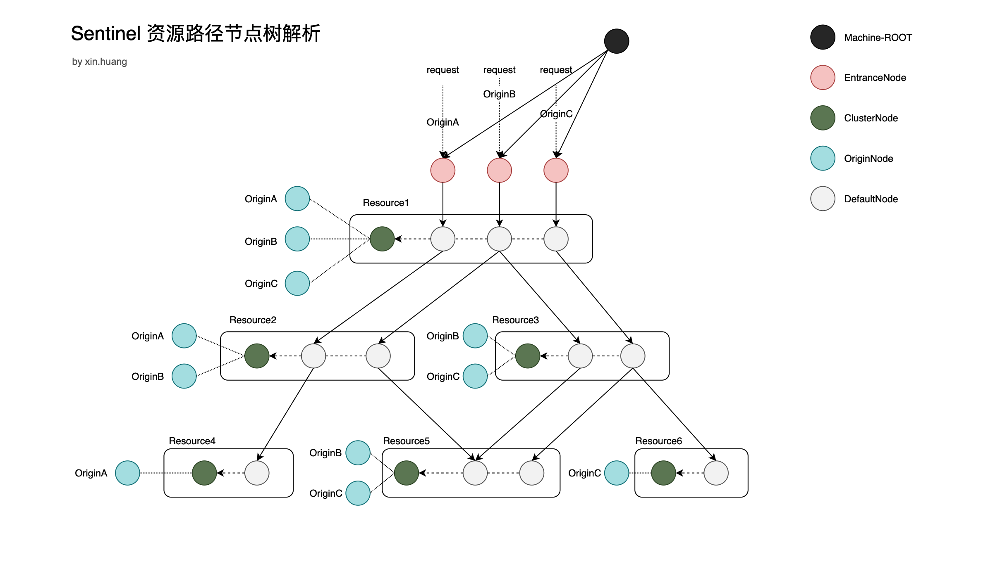

## Sentinel 分布式系统的流量防卫兵
随着微服务的流行，服务和服务之间的稳定性变得越来越重要。Sentinel 以流量为切入点，从流量控制、熔断降级、系统负载保护等多个维度保护服务的稳定性。

Sentinel 具有以下特征:

* 丰富的应用场景：Sentinel 承接了阿里巴巴近 10 年的双十一大促流量的核心场景，例如秒杀（即突发流量控制在系统容量可以承受的范围）、消息削峰填谷、集群流量控制、实时熔断下游不可用应用等。
* 完备的实时监控：Sentinel 同时提供实时的监控功能。您可以在控制台中看到接入应用的单台机器秒级数据，甚至 500 台以下规模的集群的汇总运行情况。
* 广泛的开源生态：Sentinel 提供开箱即用的与其它开源框架/库的整合模块，例如与 Spring Cloud、Dubbo、gRPC 的整合。您只需要引入相应的依赖并进行简单的配置即可快速地接入 Sentinel。
* 完善的 SPI 扩展点：Sentinel 提供简单易用、完善的 SPI 扩展接口。您可以通过实现扩展接口来快速地定制逻辑。例如定制规则管理、适配动态数据源等。

Sentinel特性：


## Sentinel 是什么？

随着微服务的流行，服务和服务之间的稳定性变得越来越重要。Sentinel 是面向分布式服务架构的流量控制组件，主要以流量为切入点，从限流、流量整形、熔断降级、系统负载保护、热点防护等多个维度来帮助开发者保障微服务的稳定性。


## Sentinel 的基本概念？

### 资源
资源是 Sentinel 的关键概念。它可以是 Java 应用程序中的任何内容，例如，由应用程序提供的服务，或由应用程序调用的其它应用提供的服务，甚至可以是一段代码。在接下来的文档中，我们都会用资源来描述代码块。

只要通过 Sentinel API 定义的代码，就是资源，能够被 Sentinel 保护起来。大部分情况下，可以使用方法签名，URL，甚至服务名称作为资源名来标示资源。
### 规则
围绕资源的实时状态设定的规则，可以包括流量控制规则、熔断降级规则以及系统保护规则。所有规则可以动态实时调整。

## Sentinel 功能和理念设计
### 流量控制
#### 什么是流量控制
流量控制在网络传输中是一个常用的概念，它用于调整网络包的发送数据。然而，从系统稳定性角度考虑，在处理请求的速度上，也有非常多的讲究。任意时间到来的请求往往是随机不可控的，而系统的处理能力是有限的。我们需要根据系统的处理能力对流量进行控制。Sentinel 作为一个调配器，可以根据需要把随机的请求调整成合适的形状，如下图所示：


#### 流量控制设计理念
流量控制有以下几个角度:

* 资源的调用关系，例如资源的调用链路，资源和资源之间的关系；
* 运行指标，例如 QPS、线程池、系统负载等；
* 控制的效果，例如直接限流、冷启动、排队等。

Sentinel 的设计理念是让您自由选择控制的角度，并进行灵活组合，从而达到想要的效果。

### 熔断降级
#### 什么是熔断降级
除了流量控制以外，及时对调用链路中的不稳定因素进行熔断也是 Sentinel 的使命之一。由于调用关系的复杂性，如果调用链路中的某个资源出现了不稳定，可能会导致请求发生堆积，进而导致级联错误。

Sentinel 和 Hystrix 的原则是一致的: 当检测到调用链路中某个资源出现不稳定的表现，例如请求响应时间长或异常比例升高的时候，则对这个资源的调用进行限制，让请求快速失败，避免影响到其它的资源而导致级联故障。

#### 熔断降级的设计理念
在限制的手段上，Sentinel 和 Hystrix 采取了完全不一样的方法。

Hystrix 通过 线程池隔离 的方式，来对依赖（在 Sentinel 的概念中对应 资源）进行了隔离。这样做的好处是资源和资源之间做到了最彻底的隔离。缺点是除了增加了线程切换的成本（过多的线程池导致线程数目过多），还需要预先给各个资源做线程池大小的分配。

Sentinel 对这个问题采取了两种手段:
* 通过并发线程数进行限制
* 通过响应时间对资源进行降级

## 为什么需要集群限流？
为什么要使用集群流控呢？假设我们希望给某个用户限制调用某个 API 的总 QPS 为 50，但机器数可能很多（比如有 100 台）。这时候我们很自然地就想到，找一个 server 来专门来统计总的调用量，其它的实例都与这台 server 通信来判断是否可以调用。这就是最基础的集群流控的方式。

另外集群流控还可以解决流量不均匀导致总体限流效果不佳的问题。假设集群中有 10 台机器，我们给每台机器设置单机限流阈值为 10 QPS，理想情况下整个集群的限流阈值就为 100 QPS。不过实际情况下流量到每台机器可能会不均匀，会导致总量没有到的情况下某些机器就开始限流。因此仅靠单机维度去限制的话会无法精确地限制总体流量。而集群流控可以精确地控制整个集群的调用总量，结合单机限流兜底，可以更好地发挥流量控制的效果。

## Sentinel 的熔断降级策略
1. 平均响应时间（`DEGRADE_GRADE_RT`）：当 1s 内持续进入 N 个请求，对应时刻的平均响应时间（秒级）均超过阈值（`count`，以 ms 为单位），那么在接下的时间窗口（`DegradeRule` 中的 `timeWindow`，以 s 为单位）之内，对这个方法的调用都会自动地熔断（抛出 `DegradeException`）。注意 Sentinel 默认统计的 RT 上限是 4900 ms，超出此阈值的都会算作 4900 ms，若需要变更此上限可以通过启动配置项 `-Dcsp.sentinel.statistic.max.rt=xxx` 来配置。
2. 异常比例（`DEGRADE_GRADE_RT`）：当资源的每秒请求量 >= N（可配置），并且每秒异常总数占通过量的比值超过阈值（`DegradeRule` 中的 count）之后，资源进入降级状态，即在接下的时间窗口（`DegradeRule` 中的 `timeWindow`，以 s 为单位）之内，对这个方法的调用都会自动地返回。异常比率的阈值范围是 `[0.0, 1.0]`，代表 0% - 100%。
3. 异常数 (`DEGRADE_GRADE_EXCEPTION_COUNT`)：当资源近 1 分钟的异常数目超过阈值之后会进行熔断。注意由于统计时间窗口是分钟级别的，若 `timeWindow` 小于 60s，则结束熔断状态后仍可能再进入熔断状态。

熔断策略上猫眼 Oceanus 优势：
1. 梯度熔断、梯度恢复
2. 异常统计参数支持业务返回值

## Sentinel 底层数据结构解析
Sentinel 做熔断限流需要统计一段时间内的 QPS、RT、异常数等数据，在高并发场景下这些数据如何正确且高效的记录、存储就是一个非常有难度的事情。

为了解决实时数据统计的问题，Sentinel 采用了一套精密的数据结构来支持。

* Striped64 累加器并发组件
* LongAdder 继承自 `Striped64`，用于高并发计数
* MetricBucket 表示一段时间内的指标数据，底层使用 `LongAdder` 进行计数，指标由 `MetricEvent` 枚举定义
    * MetricEvent 目前定义了6个指标，分别是 PASS（通过量）、BLOCK（拒绝量）、EXCEPTION（异常数）、SUCCESS（成功数）、RT（平均响应时间）、OCCUPIED_PASS（通过了未来的配额）
* WindowWrap 包装一段时间窗口数据的实体
* LeapArray 滑动窗口对数据进行计数的抽象实现，需要子类实现 `newEmptyBucket` 和 `resetWindowTo` 方法
    * BucketLeapArray 继承自 `LeapArray` ，时间跨度度量统计的基本数据结构
    * ClusterMetricLeapArray
    * ClusterParameterLeapArray
    * FutureBucketLeapArray
    * HotParameterLeapArray
    * OccupiableBucketLeapArray
    * UnaryLeapArray
* ArrayMetric 最高层的数据结构，Sentinel 最基本的指标类

下面让我们一起逐个分析这些数据结构吧。

### Striped64 & LongAdder
`Striped64` 提供了并发计数的基本组件，`LongAdder` 继承自 `Striped64`，实现了 `Number` 类的特性。
> [Java 并发计数组件Striped64详解](https://www.jianshu.com/p/30d328e9353b)

### MetricBucket
`MetricBucket` 内部有一个 `LongAdder[]` 实现指标计数，在构造函数中默认定义了 `MetricEvent` 里的所有指标，通过枚举中的ordinal为数组索引定位指标。

### WindowWrap
`WindowWrap` 故名思议就是一段窗口内容的包装类，主要有三个字段：
1. `windowLengthInMs` 窗口的大小（单位ms）
2. `windowStart` 窗口的开始时间
3. `value` 真正的数据 

### LeapArray
`LeapArray` 是一个基于数组实现的滑动窗口。LeapArray的源码学习见：[sentinel学习之LeapArray](./sentinel学习之LeapArray.md)

### BucketLeapArray
继承自 `LeapArray`，最基本的时间跨度度量统计的数据结构，是 `ArrayMetric` 默认使用的数据结构。

### ArrayMetric
Sentinel中的基本度量标准类，使用内部{@link BucketLeapArray}，有很多获取指标信息的方法。

## Sentinel 的 Slot 链
在 Sentinel 里面，所有的资源都对应一个资源名称（`resourceName`），每次资源调用都会创建一个 `Entry` 对象。Entry 可以通过对主流框架的适配自动创建，也可以通过注解的方式或调用 `SphU` API 显式创建。Entry 创建的时候，同时也会创建一系列功能插槽（slot chain），这些插槽有不同的职责，例如:

* `NodeSelectorSlot` 负责收集资源的路径，并将这些资源的调用路径，以树状结构存储起来，用于根据调用路径来限流降级；
* `ClusterBuilderSlot` 则用于存储资源的统计信息以及调用者信息，例如该资源的 RT, QPS, thread count 等等，这些信息将用作为多维度限流，降级的依据；
* `StatisticSlot` 则用于记录、统计不同纬度的 runtime 指标监控信息；
* `FlowSlot` 则用于根据预设的限流规则以及前面 slot 统计的状态，来进行流量控制；
* `AuthoritySlot` 则根据配置的黑白名单和调用来源信息，来做黑白名单控制；
* `DegradeSlot` 则通过统计信息以及预设的规则，来做熔断降级；
* `SystemSlot` 则通过系统的状态，例如 load1 等，来控制总的入口流量；

总体的框架如下:


Sentinel 将 ProcessorSlot 作为 SPI 接口进行扩展（1.7.2 版本以前 SlotChainBuilder 作为 SPI），使得 Slot Chain 具备了扩展的能力。您可以自行加入自定义的 slot 并编排 slot 间的顺序，从而可以给 Sentinel 添加自定义的功能。


### Slot 链的创建 
* SlotChainProvider
提供 SPI 扩展机制，可以根据开发者需要加载自己的 `SlotChainBuilder`，默认使用 `DefaultSlotChainBuilder`。

> [高级开发必须理解的Java中SPI机制](https://www.jianshu.com/p/46b42f7f593c)
* SlotChainBuilder
建造默认的 Slot 链，包括 8 个 slot。
1. NodeSelectorSlot 建立树状结构（调用链路）
2. ClusterBuilderSlot 根据资源保存统计簇点
3. LogSlot 日志记录
4. StatisticSlot 实时数据统计
5. SystemSlot 系统保护
6. AuthoritySlot 权限控制 
7. FlowSlot 流量控制
8. DegradeSlot 熔断降级

### Slot 链何时创建？
CtSph 获取 entry 时会调用 `lookProcessChain` 方法创建 slot 链，一个 resource 对应一条 slot 链。

### Sentinel 的基本组件
* Context
* ContextUtil
* Entry
* Node
    * StatisticNode
        * DefaultNode
            * EntranceNode
        * ClusterNode
* SlotChain

### SDK 的入口
我们了解一个组件，需要有特定的思路，通常都是从整体架构开始看，再从入口逐步去了解每个模块。现在我们来探究 Sentinel 作为一个 SDK，它从哪里开始工作的。

#### Env —— Sentinel 初始化之源
Env类代码很简单，只有几行。初始化的源头就是从 `InitExecutor.doInit` 开始的，而静态变量 `sph` 主要就是 entry 申请的唯一入口。 

```java
/**
 * Sentinel Env. This class will trigger all initialization for Sentinel.
 * Sentinel 环境。这个类将触发 Sentinel 的所有初始化动作。
 * <p>
 * NOTE: to prevent deadlocks, other classes' static code block or static field should
 * 提示：为了防止死锁，其他类的静态代码块或静态字段永远不要引用此类。
 * NEVER refer to this class.
 * </p>
 *
 * @author jialiang.linjl
 */
public class Env {

    public static final Sph sph = new CtSph();

    static {
        // If init fails, the process will exit.
        InitExecutor.doInit();
    }

}
```

#### InitExecutor 初始化执行器
`InitExecutor` 的功能是加载已注册的init函数并按顺序执行，其核心也就是利用了 Java 的 SPI 机制，让程序变得可扩展。

SDK 的 ***通信模块***、***集群限流模块*** 和 ***数据源注册模块*** 都是通过该执行器来初始化的。当然，如果有需要我们也可以去进行扩展，方式很简单：只需要实现一个叫 `InitFunc` 的接口，并在 `META-INF/services` 加上全限定类名就好了。

接下来我们看下他是如何进行初始化的，直接看代码：
```java
public final class InitExecutor {

    // 原子变量，CAS 保证初始化只会执行一次
    private static AtomicBoolean initialized = new AtomicBoolean(false);

    /**
     * If one {@link InitFunc} throws an exception, the init process
     * will immediately be interrupted and the application will exit.
     *
     * The initialization will be executed only once.
     */
    public static void doInit() {
        // 保证 doInit 方法只会执行一次
        if (!initialized.compareAndSet(false, true)) {
            return;
        }
        try {
            // 通过 Java 的 SPI 机制，加载并是实例化目录 META-INF/services 下配置的所有实现了 InitFunc 接口的类
            ServiceLoader<InitFunc> loader = ServiceLoader.load(InitFunc.class);
            List<OrderWrapper> initList = new ArrayList<OrderWrapper>();
            for (InitFunc initFunc : loader) {
                RecordLog.info("[InitExecutor] Found init func: " + initFunc.getClass().getCanonicalName());
                // 重新包装 initFunc 并按照 InitOrder 注解的 value 值进行排序
                insertSorted(initList, initFunc);
            }
            // 遍历整个list，执行初始化方法
            for (OrderWrapper w : initList) {
                w.func.init();
                RecordLog.info(String.format("[InitExecutor] Executing %s with order %d",
                    w.func.getClass().getCanonicalName(), w.order));
            }
        } catch (Exception ex) {
            RecordLog.warn("[InitExecutor] WARN: Initialization failed", ex);
            ex.printStackTrace();
        } catch (Error error) {
            RecordLog.warn("[InitExecutor] ERROR: Initialization failed with fatal error", error);
            error.printStackTrace();
        }
    }

    private static void insertSorted(List<OrderWrapper> list, InitFunc func) {
        int order = resolveOrder(func);
        int idx = 0;
        for (; idx < list.size(); idx++) {
            if (list.get(idx).getOrder() > order) {
                break;
            }
        }
        list.add(idx, new OrderWrapper(order, func));
    }

    // 获取优先级，如果没有注解则使用默认优先级
    private static int resolveOrder(InitFunc func) {
        if (!func.getClass().isAnnotationPresent(InitOrder.class)) {
            return InitOrder.LOWEST_PRECEDENCE;
        } else {
            return func.getClass().getAnnotation(InitOrder.class).value();
        }
    }

    private InitExecutor() {}

    private static class OrderWrapper {
        private final int order;
        private final InitFunc func;

        OrderWrapper(int order, InitFunc func) {
            this.order = order;
            this.func = func;
        }

        int getOrder() {
            return order;
        }

        InitFunc getFunc() {
            return func;
        }
    }
}
``` 

我们可以看个例子，如果配置了SDK的通信模块它是怎么启动的，代码如下：

```java
/**
 * 命令中心：装载了该模块后我们就可以和SDK进行通信，例如查看当前SDK上的规则配置什么的 
 */
@InitOrder(-1)
public class CommandCenterInitFunc implements InitFunc {

    @Override
    public void init() throws Exception {
        CommandCenter commandCenter = CommandCenterProvider.getCommandCenter();

        if (commandCenter == null) {
            RecordLog.warn("[CommandCenterInitFunc] Cannot resolve CommandCenter");
            return;
        }

        commandCenter.beforeStart();
        commandCenter.start();
        RecordLog.info("[CommandCenterInit] Starting command center: "
                + commandCenter.getClass().getCanonicalName());
    }
}

/**
 * 心跳发送器：主要是定时和管理端发送心跳信息，用来检测机器是否存活，还会附带发送SDK版本等信息 
 */
@InitOrder(-1)
public class HeartbeatSenderInitFunc implements InitFunc {
    // ...省略
    
    @Override
    public void init() {
        HeartbeatSender sender = HeartbeatSenderProvider.getHeartbeatSender();
        if (sender == null) {
            RecordLog.warn("[HeartbeatSenderInitFunc] WARN: No HeartbeatSender loaded");
            return;
        }

        initSchedulerIfNeeded();
        long interval = retrieveInterval(sender);
        setIntervalIfNotExists(interval);
        scheduleHeartbeatTask(sender, interval);
    }
    
    // ...省略
}
```
可以看到，两个模块初始化的流程基本都是类似的，第一行代码甚至都是再通过SPI来动态加载需要实例化的类，后续也就是初始化和启动操作。

#### Sph 获取 Entry 的入口
`Sph` 是一个接口，定义了获取 `Entry` 的各种重载方法.能够获取到 `Entry` 就说明通过了资源申请，否则会抛出 `BlockException`。

`Sph` 的唯一实现类是 `CtSph`。

#### CtSph 获取 Entry 
前面说到过 `Env` 是 Sentinel 程序的启动入口，`Env` 的一个静态变量就是 `CtSph`，现在来看 `CtSph` 的实现。

CtSph 有 3 个静态变量：
 1. OBJECTS0: 用作默认的接口参数
 2. chainMap: 保存所有的 *<资源:处理器链>* 的映射
 3. LOCK: 创建处理器链的锁

`CtSph` 实现了 `Sph` 所有的方法，这些获取 `Entry` 的方法可以分成两大类，一类是 **同步获取Entry**，另一类是 **异步获取Entry**。而获取两种 Entry 的方法，最终就是两个：`entryWithPriority` 和 `asyncEntryWithPriorityInternal`。 

```java
public class CtSph implements Sph {
    
    private Entry entryWithPriority(ResourceWrapper resourceWrapper, int count, boolean prioritized, Object... args)
        throws BlockException {
        // 获取上下文
        Context context = ContextUtil.getContext();
        if (context instanceof NullContext) {
            // 如果获取到的是空上下文则说明上下文个数超出了创建限制，这里直接返回，后续规则检查也不会进行了
            // The {@link NullContext} indicates that the amount of context has exceeded the threshold,
            // so here init the entry only. No rule checking will be done.
            return new CtEntry(resourceWrapper, null, context);
        }

        if (context == null) {
            // Using default context.
            // 如果上下文为空则使用默认的上下文
            context = MyContextUtil.myEnter(Constants.CONTEXT_DEFAULT_NAME, "", resourceWrapper.getType());
        }

        // Global switch is close, no rule checking will do.
        // 全局开关，默认是开启状态。如果规则开关关闭则所有策略失效。
        if (!Constants.ON) {
            return new CtEntry(resourceWrapper, null, context);
        }

        // 走到这里很关键，通过 resourceWrapper 查找处理器链（slotChain）
        ProcessorSlot<Object> chain = lookProcessChain(resourceWrapper);

        /*
         * Means amount of resources (slot chain) exceeds {@link Constants.MAX_SLOT_CHAIN_SIZE},
         * so no rule checking will be done.
         * 处理器链有可能获取到空，原因是在 lookProcessChain 里面做了创建数量限制，因该是怕SDK占用系统资源过多角度考虑设计的
         */
        if (chain == null) {
            return new CtEntry(resourceWrapper, null, context);
        }

        Entry e = new CtEntry(resourceWrapper, chain, context);
        try {
            // 执行处理器链处理资源的规则
            chain.entry(context, resourceWrapper, null, count, prioritized, args);
        } catch (BlockException e1) {
            // 退出 entry
            e.exit(count, args);
            throw e1;
        } catch (Throwable e1) {
            // This should not happen, unless there are errors existing in Sentinel internal.
            RecordLog.info("Sentinel unexpected exception", e1);
        }
        return e;
    }
}
```

接下来继续看 `lookProcessChain` 方法是如何获取处理链的：

```java
public class CtSph implements Sph {
    /**
     * Get {@link ProcessorSlotChain} of the resource. new {@link ProcessorSlotChain} will
     * be created if the resource doesn't relate one.
     * 获取当前资源的处理器链，如果当前资源没有相关联的处理器链则创建。
     *
     * <p>Same resource({@link ResourceWrapper#equals(Object)}) will share the same
     * {@link ProcessorSlotChain} globally, no matter in witch {@link Context}.<p/>
     * 相同的资源共享相同的处理器链，不管上下文是否相同。
     *
     * <p>
     * Note that total {@link ProcessorSlot} count must not exceed {@link Constants#MAX_SLOT_CHAIN_SIZE},
     * otherwise null will return.
     * 处理器链的数量必须小于 MAX_SLOT_CHAIN_SIZE，否则直接返回 null
     * </p>
     *
     * @param resourceWrapper target resource
     * @return {@link ProcessorSlotChain} of the resource
     */
    ProcessorSlot<Object> lookProcessChain(ResourceWrapper resourceWrapper) {
        ProcessorSlotChain chain = chainMap.get(resourceWrapper);
        // double check 方式获取处理器链
        if (chain == null) {
            synchronized (LOCK) {
                chain = chainMap.get(resourceWrapper);
                
                if (chain == null) {
                    // Entry size limit.
                    // 超出数量限制返回 null
                    if (chainMap.size() >= Constants.MAX_SLOT_CHAIN_SIZE) {
                        return null;
                    }

                    // 通过 SPI 机制获取 SlotChainBuilder 后创建处理器链
                    chain = SlotChainProvider.newSlotChain();
                    Map<ResourceWrapper, ProcessorSlotChain> newMap = new HashMap<ResourceWrapper, ProcessorSlotChain>(
                        chainMap.size() + 1);
                    newMap.putAll(chainMap);
                    newMap.put(resourceWrapper, chain);
                    // copy on write 更新 资源 到 处理器链 的map
                    chainMap = newMap;
                }
            }
        }
        return chain;
    }
}
```

可以知道资源和处理器链的关系是1对1的，chainMap 由 CtSph 全局保存。

### SlotChainProvider 处理器链提供者
通过SPI的机制产生 SlotChainBuilder，Sentinel 提供了一个默认的 SlotChainBuilder。
DefaultSlotChainBuilder 负责建造处理器链，处理器链由很多个插槽依次编排而成：

```java
public class DefaultSlotChainBuilder implements SlotChainBuilder {

    @Override
    public ProcessorSlotChain build() {
        ProcessorSlotChain chain = new DefaultProcessorSlotChain();
        chain.addLast(new NodeSelectorSlot());
        chain.addLast(new ClusterBuilderSlot());
        chain.addLast(new LogSlot());
        chain.addLast(new StatisticSlot());
        chain.addLast(new SystemSlot());
        chain.addLast(new AuthoritySlot());
        chain.addLast(new FlowSlot());
        chain.addLast(new DegradeSlot());
        return chain;
    }
}
```

#### 资源路径节点树解析
下面这张图梳理出了各种类型的节点之间的关系，清楚了这张图的含义便能理解Sentinel是如何做流量管理的。


Sentinel 为了构建调用链关系，设计了树状节点 `Node` 的概念，从上图可以看到节点有5种：
1. ROOT 根节点，负责统计整个服务的流控数据，在 `SystemSlot` 中用来做系统保护。由 `com.alibaba.csp.sentinel.Constants` 维护。
2. EntranceNode 入口节点，不同的上下文有不同的 `EntranceNode`。由 `com.alibaba.csp.sentinel.context.Context` 维护。
3. ClusterNode 聚集节点，负责统计资源的流控数据，与资源是1对1的关系，在 `FlowSlot` 中用来做资源流控保护。资源与 `ClusterNode` 的关系，由 `com.alibaba.csp.sentinel.slots.clusterbuilder.ClusterBuilderSlot` 维护。
4. OriginNode 调用源节点，负责统计某个调用源的数据，与调用源是1对1的关系，在 `FlowSlot` 中用来做配额流控。由 `com.alibaba.csp.sentinel.node.ClusterNode` 维护。
5. DefaultNode 上下文资源节点，负责统计当前上下文对当前资源的流控数据，同一个上下文和一个资源对应1个该节点，在 `FlowSlot` 用于链流控制（通过入口资源）。由 `com.alibaba.csp.sentinel.slots.nodeselector.NodeSelectorSlot` 维护。


### NodeSelectorSlot 
创建上下文资源节点，并设置当前节点为上下文节点。
```java
/**
 * </p>
 * This class will try to build the calling traces via
 * 这个类用来尝试建立调用跟踪
 * <ol>
 * <li>adding a new {@link DefaultNode} if needed as the last child in the context.
 * The context's last node is the current node or the parent node of the context. </li>
 * 如果需要，添加新的 DefaultNode 作为上下文中的最后一个子级。上下文的最后一个节点是上下文的当前节点或父节点。
 * <li>setting itself to the context current node.</li>
 * 设置自己作为上下文的当前节点
 * </ol>
 * </p>
 *
 * <p>It works as follow:</p>
 * <pre>
 * ContextUtil.enter("entrance1", "appA");
 * Entry nodeA = SphU.entry("nodeA");
 * if (nodeA != null) {
 *     nodeA.exit();
 * }
 * ContextUtil.exit();
 * </pre>
 *
 * Above code will generate the following invocation structure in memory:
 * 上面的代码将在内存中生成如下调用结构：
 *
 * <pre>
 *
 *              machine-root
 *                  /
 *                 /
 *           EntranceNode1
 *               /
 *              /
 *        DefaultNode(nodeA)- - - - - -> ClusterNode(nodeA);
 * </pre>
 *
 * <p>
 * Here the {@link EntranceNode} represents "entrance1" given by
 * {@code ContextUtil.enter("entrance1", "appA")}.
 * </p>
 * <p>
 * Both DefaultNode(nodeA) and ClusterNode(nodeA) holds statistics of "nodeA", which is given
 * by {@code SphU.entry("nodeA")}
 * 上面的 DefaultNode(nodeA) 和 ClusterNode(nodeA) 持有 nodeA 的统计数据。
 * </p>
 * <p>
 * The {@link ClusterNode} is uniquely identified by the ResourceId; the {@link DefaultNode}
 * is identified by both the resource id and {@link Context}. In other words, one resource
 * id will generate multiple {@link DefaultNode} for each distinct context, but only one
 * {@link ClusterNode}.
 * ClusterNode 由 资源ID 唯一标识；
 * DefaultNode 由 资源ID 和 上下文 共同标识。换句话说，一个 资源ID 为不同的上下文生成多个 DefaultNode，但只有一个 ClusterNode。
 * </p>
 * <p>
 * the following code shows one resource id in two different context:
 * </p>
 *
 * <pre>
 *    ContextUtil.enter("entrance1", "appA");
 *    Entry nodeA = SphU.entry("nodeA");
 *    if (nodeA != null) {
 *        nodeA.exit();
 *    }
 *    ContextUtil.exit();
 *
 *    ContextUtil.enter("entrance2", "appA");
 *    nodeA = SphU.entry("nodeA");
 *    if (nodeA != null) {
 *        nodeA.exit();
 *    }
 *    ContextUtil.exit();
 * </pre>
 *
 * Above code will generate the following invocation structure in memory:
 *
 * <pre>
 *
 *                  machine-root
 *                  /         \
 *                 /           \
 *         EntranceNode1   EntranceNode2
 *               /               \
 *              /                 \
 *      DefaultNode(nodeA)   DefaultNode(nodeA)
 *             |                    |
 *             +- - - - - - - - - - +- - - - - - -> ClusterNode(nodeA);
 * </pre>
 *
 * <p>
 * As we can see, two {@link DefaultNode} are created for "nodeA" in two context, but only one
 * {@link ClusterNode} is created.
 * 正如我们所见，nodeA 创建了两个 DefaultNode，
 * </p>
 *
 * <p>
 * We can also check this structure by calling: <br/>
 * {@code curl http://localhost:8719/tree?type=root}
 * </p>
 *
 * @author jialiang.linjl
 * @see EntranceNode
 * @see ContextUtil
 */
public class NodeSelectorSlot extends AbstractLinkedProcessorSlot<Object> {

    /**
     * {@link DefaultNode}s of the same resource in different context.
     */
    private volatile Map<String, DefaultNode> map = new HashMap<String, DefaultNode>(10);

    @Override
    public void entry(Context context, ResourceWrapper resourceWrapper, Object obj, int count, boolean prioritized, Object... args)
        throws Throwable {
        /*
         * It's interesting that we use context name rather resource name as the map key.
         * 有意思的是我们使用上下文名称而不是使用资源名来做map的key
         *
         * Remember that same resource({@link ResourceWrapper#equals(Object)}) will share
         * the same {@link ProcessorSlotChain} globally, no matter in which context. So if
         * code goes into {@link #entry(Context, ResourceWrapper, DefaultNode, int, Object...)},
         * the resource name must be same but context name may not.
         * 请记住相同的资源将共享相同的处理器链，不管上下文是什么。所以如果代码执行进 entry，资源名必须相同，但上下文可能不同。
         *
         * If we use {@link com.alibaba.csp.sentinel.SphU#entry(String resource)} to
         * enter same resource in different context, using context name as map key can
         * distinguish the same resource. In this case, multiple {@link DefaultNode}s will be created
         * of the same resource name, for every distinct context (different context name) each.
         * 如果我们在不同的上下文使用 SphU.entry 进入相同的资源，使用上下文名称作为map的key可以区分不同的资源。
         * 在这种情况下，将创建多个 DefaultNode 对于每个不同的上下文（不同的上下文名称），都具有相同的资源名称。
         *
         * Consider another question. One resource may have multiple {@link DefaultNode},
         * so what is the fastest way to get total statistics of the same resource?
         * The answer is all {@link DefaultNode}s with same resource name share one
         * {@link ClusterNode}. See {@link ClusterBuilderSlot} for detail.
         * 考虑另一个问题。一个资源可能具有多个 DefaultNode，那么获取同一资源的总统计信息的最快方法是什么？
         * 答案是所有具有相同资源名称的{@link DefaultNode}共享一个{@link ClusterNode}。
         * 有关详细信息，请参见{@link ClusterBuilderSlot}。
         */
        DefaultNode node = map.get(context.getName());
        if (node == null) {
            synchronized (this) {
                node = map.get(context.getName());
                if (node == null) {
                    node = new DefaultNode(resourceWrapper, null);
                    HashMap<String, DefaultNode> cacheMap = new HashMap<String, DefaultNode>(map.size());
                    cacheMap.putAll(map);
                    cacheMap.put(context.getName(), node);
                    map = cacheMap;
                    // Build invocation tree
                    ((DefaultNode) context.getLastNode()).addChild(node);
                }

            }
        }

        context.setCurNode(node);
        fireEntry(context, resourceWrapper, node, count, prioritized, args);
    }

    @Override
    public void exit(Context context, ResourceWrapper resourceWrapper, int count, Object... args) {
        fireExit(context, resourceWrapper, count, args);
    }
}
```

#### ClusterBuilderSlot
根据资源来创建聚集节点，并且设置各种节点的关系。
```java
/**
 * <p>
 * This slot maintains resource running statistics (response time, qps, thread
 * count, exception), and a list of callers as well which is marked by
 *  * {@link ContextUtil#enter(String origin)}
 * 这个slot保持这资源运行时的统计数据（响应时间，qps，线程数，异常情况），以及被 ContextUtil.entry 标记的调用者列表
 * </p>
 * <p>
 * One resource has only one cluster node, while one resource can have multiple
 * default nodes.
 * 一个资源只有一个ClusterNode，但是一个资源可以有多个DefaultNode
 * </p>
 *
 * @author jialiang.linjl
 */
public class ClusterBuilderSlot extends AbstractLinkedProcessorSlot<DefaultNode> {

    /**
     * <p>
     * Remember that same resource({@link ResourceWrapper#equals(Object)}) will share
     * the same {@link ProcessorSlotChain} globally, no matter in witch context. So if
     * code goes into {@link #entry(Context, ResourceWrapper, DefaultNode, int, boolean, Object...)},
     * the resource name must be same but context name may not.
     * </p>
     * <p>
     * To get total statistics of the same resource in different context, same resource
     * shares the same {@link ClusterNode} globally. All {@link ClusterNode}s are cached
     * in this map.
     * </p>
     * <p>
     * The longer the application runs, the more stable this mapping will
     * become. so we don't concurrent map but a lock. as this lock only happens
     * at the very beginning while concurrent map will hold the lock all the time.
     * 程序运行的时间越长，这个映射将变得越稳定。所以我们只需要一个锁而不需要使用并发map，锁只在一开始使用，而使用并发map那么锁将一直存在。
     * </p>
     */
    private static volatile Map<ResourceWrapper, ClusterNode> clusterNodeMap = new HashMap<>();

    private static final Object lock = new Object();

    private volatile ClusterNode clusterNode = null;

    @Override
    public void entry(Context context, ResourceWrapper resourceWrapper, DefaultNode node, int count,
                      boolean prioritized, Object... args)
        throws Throwable {
        if (clusterNode == null) {
            synchronized (lock) {
                if (clusterNode == null) {
                    // Create the cluster node.
                    clusterNode = new ClusterNode();
                    HashMap<ResourceWrapper, ClusterNode> newMap = new HashMap<>(Math.max(clusterNodeMap.size(), 16));
                    newMap.putAll(clusterNodeMap);
                    newMap.put(node.getId(), clusterNode);

                    clusterNodeMap = newMap;
                }
            }
        }
        node.setClusterNode(clusterNode);

        /*
         * if context origin is set, we should get or create a new {@link Node} of
         * the specific origin.
         * 如果设置了上下文来源，则应获取或创建一个特定来源的新节点。
         */
        if (!"".equals(context.getOrigin())) {
            Node originNode = node.getClusterNode().getOrCreateOriginNode(context.getOrigin());
            context.getCurEntry().setOriginNode(originNode);
        }

        fireEntry(context, resourceWrapper, node, count, prioritized, args);
    }

    @Override
    public void exit(Context context, ResourceWrapper resourceWrapper, int count, Object... args) {
        fireExit(context, resourceWrapper, count, args);
    }

    /**
     * Get {@link ClusterNode} of the resource of the specific type.
     *
     * @param id   resource name.
     * @param type invoke type.
     * @return the {@link ClusterNode}
     */
    public static ClusterNode getClusterNode(String id, EntryType type) {
        return clusterNodeMap.get(new StringResourceWrapper(id, type));
    }

    /**
     * Get {@link ClusterNode} of the resource name.
     *
     * @param id resource name.
     * @return the {@link ClusterNode}.
     */
    public static ClusterNode getClusterNode(String id) {
        if (id == null) {
            return null;
        }
        ClusterNode clusterNode = null;

        for (EntryType nodeType : EntryType.values()) {
            clusterNode = clusterNodeMap.get(new StringResourceWrapper(id, nodeType));
            if (clusterNode != null) {
                break;
            }
        }

        return clusterNode;
    }

    /**
     * Get {@link ClusterNode}s map, this map holds all {@link ClusterNode}s, it's key is resource name,
     * value is the related {@link ClusterNode}. <br/>
     * DO NOT MODIFY the map returned.
     *
     * @return all {@link ClusterNode}s
     */
    public static Map<ResourceWrapper, ClusterNode> getClusterNodeMap() {
        return clusterNodeMap;
    }

    /**
     * Reset all {@link ClusterNode}s. Reset is needed when {@link IntervalProperty#INTERVAL} or
     * {@link SampleCountProperty#SAMPLE_COUNT} is changed.
     */
    public static void resetClusterNodes() {
        for (ClusterNode node : clusterNodeMap.values()) {
            node.reset();
        }
    }
}

```

#### LogSlot
用于记录调用链的日志，并且捕获内部异常。
```java
/**
 * A {@link com.alibaba.csp.sentinel.slotchain.ProcessorSlot} that is response for logging block exceptions
 * to provide concrete logs for troubleshooting.
 */
public class LogSlot extends AbstractLinkedProcessorSlot<DefaultNode> {

    @Override
    public void entry(Context context, ResourceWrapper resourceWrapper, DefaultNode obj, int count, boolean prioritized, Object... args)
        throws Throwable {
        try {
            fireEntry(context, resourceWrapper, obj, count, prioritized, args);
        } catch (BlockException e) {
            EagleEyeLogUtil.log(resourceWrapper.getName(), e.getClass().getSimpleName(), e.getRuleLimitApp(),
                context.getOrigin(), count);
            throw e;
        } catch (Throwable e) {
            RecordLog.warn("Unexpected entry exception", e);
        }

    }

    @Override
    public void exit(Context context, ResourceWrapper resourceWrapper, int count, Object... args) {
        try {
            fireExit(context, resourceWrapper, count, args);
        } catch (Throwable e) {
            RecordLog.warn("Unexpected entry exit exception", e);
        }
    }
}
```

#### StatisticSlot
资源统计节点，负责采集各种指标数据。
```java
/**
 * <p>
 * A processor slot that dedicates to real time statistics.
 * 专用于实时统计信息的处理器插槽。
 * When entering this slot, we need to separately count the following
 * information:
 * 进入此插槽时，我们需要分别计算以下信息：
 *
 * <ul>
 * <li>{@link ClusterNode}: total statistics of a cluster node of the resource ID.</li>
 * 聚集节点：资源ID 的聚集节点的总统计信息
 *
 * <li>Origin node: statistics of a cluster node from different callers/origins.</li>
 * 源头节点：来自不同调用者/来源的集群节点的统计信息
 *
 * <li>{@link DefaultNode}: statistics for specific resource name in the specific context.</li>
 * 默认节点：特定上下文中特定资源名称的统计信息。
 *
 * <li>Finally, the sum statistics of all entrances.</li>
 * 最后，是所有入口的总和统计。
 *
 * </ul>
 * </p>
 *
 * @author jialiang.linjl
 * @author Eric Zhao
 */
public class StatisticSlot extends AbstractLinkedProcessorSlot<DefaultNode> {

    @Override
    public void entry(Context context, ResourceWrapper resourceWrapper, DefaultNode node, int count,
                      boolean prioritized, Object... args) throws Throwable {
        try {
            // Do some checking.
            fireEntry(context, resourceWrapper, node, count, prioritized, args);

            // Request passed, add thread count and pass count.
            node.increaseThreadNum(); // 线程数加1
            node.addPassRequest(count); // 通过的请求数增加count

            if (context.getCurEntry().getOriginNode() != null) {
                // Add count for origin node.
                // 源头节点的线程数加1
                context.getCurEntry().getOriginNode().increaseThreadNum();
                // 源头节点通过请求数加count
                context.getCurEntry().getOriginNode().addPassRequest(count);
            }

            if (resourceWrapper.getType() == EntryType.IN) {
                // Add count for global inbound entry node for global statistics.
                // 如果是入口流量
                // 全局入口流量数据加1
                Constants.ENTRY_NODE.increaseThreadNum();
                // 全局入口流量通过量加1
                Constants.ENTRY_NODE.addPassRequest(count);
            }

            // Handle pass event with registered entry callback handlers.
            // 通过SPI机制增加扩展，触发监听事件
            for (ProcessorSlotEntryCallback<DefaultNode> handler : StatisticSlotCallbackRegistry.getEntryCallbacks()) {
                handler.onPass(context, resourceWrapper, node, count, args);
            }
        } catch (PriorityWaitException ex) {
            node.increaseThreadNum();
            if (context.getCurEntry().getOriginNode() != null) {
                // Add count for origin node.
                context.getCurEntry().getOriginNode().increaseThreadNum();
            }

            if (resourceWrapper.getType() == EntryType.IN) {
                // Add count for global inbound entry node for global statistics.
                Constants.ENTRY_NODE.increaseThreadNum();
            }
            // Handle pass event with registered entry callback handlers.
            for (ProcessorSlotEntryCallback<DefaultNode> handler : StatisticSlotCallbackRegistry.getEntryCallbacks()) {
                handler.onPass(context, resourceWrapper, node, count, args);
            }
        } catch (BlockException e) {
            // Blocked, set block exception to current entry.
            // 这里的异常是阻塞异常
            context.getCurEntry().setError(e);

            // Add block count.
            node.increaseBlockQps(count);
            if (context.getCurEntry().getOriginNode() != null) {
                context.getCurEntry().getOriginNode().increaseBlockQps(count);
            }

            if (resourceWrapper.getType() == EntryType.IN) {
                // Add count for global inbound entry node for global statistics.
                Constants.ENTRY_NODE.increaseBlockQps(count);
            }

            // Handle block event with registered entry callback handlers.
            for (ProcessorSlotEntryCallback<DefaultNode> handler : StatisticSlotCallbackRegistry.getEntryCallbacks()) {
                handler.onBlocked(e, context, resourceWrapper, node, count, args);
            }

            throw e;
        } catch (Throwable e) {
            // Unexpected error, set error to current entry.
            // 这里的异常是SDK的内部异常
            context.getCurEntry().setError(e);

            // This should not happen.
            // 由于当前异常是SDK异常，所以不应该发生
            node.increaseExceptionQps(count);
            if (context.getCurEntry().getOriginNode() != null) {
                context.getCurEntry().getOriginNode().increaseExceptionQps(count);
            }

            if (resourceWrapper.getType() == EntryType.IN) {
                Constants.ENTRY_NODE.increaseExceptionQps(count);
            }
            throw e;
        }
    }

    @Override
    public void exit(Context context, ResourceWrapper resourceWrapper, int count, Object... args) {
        DefaultNode node = (DefaultNode)context.getCurNode();

        if (context.getCurEntry().getError() == null) {
            // Calculate response time (max RT is TIME_DROP_VALVE).
            long rt = TimeUtil.currentTimeMillis() - context.getCurEntry().getCreateTime();
            if (rt > Constants.TIME_DROP_VALVE) {
                rt = Constants.TIME_DROP_VALVE;
            }

            // Record response time and success count.
            node.addRtAndSuccess(rt, count);
            if (context.getCurEntry().getOriginNode() != null) {
                context.getCurEntry().getOriginNode().addRtAndSuccess(rt, count);
            }

            node.decreaseThreadNum();

            if (context.getCurEntry().getOriginNode() != null) {
                context.getCurEntry().getOriginNode().decreaseThreadNum();
            }

            if (resourceWrapper.getType() == EntryType.IN) {
                Constants.ENTRY_NODE.addRtAndSuccess(rt, count);
                Constants.ENTRY_NODE.decreaseThreadNum();
            }
        } else {
            // Error may happen.
        }

        // Handle exit event with registered exit callback handlers.
        Collection<ProcessorSlotExitCallback> exitCallbacks = StatisticSlotCallbackRegistry.getExitCallbacks();
        for (ProcessorSlotExitCallback handler : exitCallbacks) {
            handler.onExit(context, resourceWrapper, count, args);
        }

        fireExit(context, resourceWrapper, count);
    }
}
```
#### SystemSlot
系统保护节点，可以根据系统总入口流量进行流控，也可以根据 load，cpu.busy 信息进行基于bbr算法的系统保护。
```java
/**
 * A {@link ProcessorSlot} that dedicates to {@link SystemRule} checking.
 *
 * @author jialiang.linjl
 * @author leyou
 */
public class SystemSlot extends AbstractLinkedProcessorSlot<DefaultNode> {

    @Override
    public void entry(Context context, ResourceWrapper resourceWrapper, DefaultNode node, int count,
                      boolean prioritized, Object... args) throws Throwable {
        SystemRuleManager.checkSystem(resourceWrapper);
        fireEntry(context, resourceWrapper, node, count, prioritized, args);
    }

    @Override
    public void exit(Context context, ResourceWrapper resourceWrapper, int count, Object... args) {
        fireExit(context, resourceWrapper, count, args);
    }

}
```
##### SystemRuleManager 系统规则管理器
```java
public class SystemRuleManager {
    
        /**
         * Apply {@link SystemRule} to the resource. Only inbound traffic will be checked.
         *
         * @param resourceWrapper the resource.
         * @throws BlockException when any system rule's threshold is exceeded.
         */
        public static void checkSystem(ResourceWrapper resourceWrapper) throws BlockException {
            // Ensure the checking switch is on.
            // 系统保护策略，只要有一个规则开了，那么系统保护规则就开了，可以看 loadSystemConf() 方法
            if (!checkSystemStatus.get()) {
                return;
            }
    
            // for inbound traffic only
            // 只针对入口流量生效
            if (resourceWrapper.getType() != EntryType.IN) {
                return;
            }
    
            // total qps
            double currentQps = Constants.ENTRY_NODE == null ? 0.0 : Constants.ENTRY_NODE.successQps();
            if (currentQps > qps) {
                // 当前QPS大于系统保护设定的QPS则触发系统保护限制异常
                throw new SystemBlockException(resourceWrapper.getName(), "qps");
            }
    
            // total thread
            int currentThread = Constants.ENTRY_NODE == null ? 0 : Constants.ENTRY_NODE.curThreadNum();
            if (currentThread > maxThread) {
                // 当前等待的线程数大于系统保护设定的线程数则触发系统保护限制异常
                throw new SystemBlockException(resourceWrapper.getName(), "thread");
            }
    
            double rt = Constants.ENTRY_NODE == null ? 0 : Constants.ENTRY_NODE.avgRt();
            if (rt > maxRt) {
                // 当前平均响应时间大于系统保护设定的平均响应时间则触发系统保护限制异常
                throw new SystemBlockException(resourceWrapper.getName(), "rt");
            }
    
            // load. BBR algorithm.
            // 是否启用了bbr算法 && 当前系统的平均负载 > 最高系统负载
            if (highestSystemLoadIsSet && getCurrentSystemAvgLoad() > highestSystemLoad) {
                if (!checkBbr(currentThread)) {
                    throw new SystemBlockException(resourceWrapper.getName(), "load");
                }
            }
    
            // cpu usage
            if (highestCpuUsageIsSet && getCurrentCpuUsage() > highestCpuUsage) {
                if (!checkBbr(currentThread)) {
                    throw new SystemBlockException(resourceWrapper.getName(), "cpu");
                }
            }
        }
    
        /*
         * 触发机制是 load 过高 或 cpu.busy 过高
         * bbr是根据过去1s中内，通过的最大请求数和当前线程数比较
         */
        private static boolean checkBbr(int currentThread) {
            // 当前线程数大于1 && 当前线程数 > 入口流量的最大成功QPS * 最小的RT / 1000
            // maxSuccessQps = 1秒内通过的请求数
            // minRt = 1秒内的最小处理时间
    
            // maxSuccessQps * minRt / 1000 的含义是：系统可承载的最大容量（最大请求数）
    
            if (currentThread > 1 &&
                currentThread > Constants.ENTRY_NODE.maxSuccessQps() * Constants.ENTRY_NODE.minRt() / 1000) {
                return false;
            }
            return true;
        }
}
```
#### AuthoritySlot
权限校验插槽，进行黑白名单校验。

```java
public class AuthoritySlot extends AbstractLinkedProcessorSlot<DefaultNode> {

    @Override
    public void entry(Context context, ResourceWrapper resourceWrapper, DefaultNode node, int count, boolean prioritized, Object... args)
        throws Throwable {
        // 检查黑白名单权限
        checkBlackWhiteAuthority(resourceWrapper, context);
        fireEntry(context, resourceWrapper, node, count, prioritized, args);
    }

    @Override
    public void exit(Context context, ResourceWrapper resourceWrapper, int count, Object... args) {
        fireExit(context, resourceWrapper, count, args);
    }

    void checkBlackWhiteAuthority(ResourceWrapper resource, Context context) throws AuthorityException {
        // 获取所有 (资源: 权限校验规则集合) 映射
        Map<String, Set<AuthorityRule>> authorityRules = AuthorityRuleManager.getAuthorityRules();

        if (authorityRules == null) {
            return;
        }

        // 获取当前资源关联的权限校验规则
        Set<AuthorityRule> rules = authorityRules.get(resource.getName());
        if (rules == null) {
            return;
        }

        // 遍历所有规则，进行权限检查
        for (AuthorityRule rule : rules) {
            if (!AuthorityRuleChecker.passCheck(rule, context)) {
                throw new AuthorityException(context.getOrigin(), rule);
            }
        }
    }
}
```

权限规则检查器：
```java
final class AuthorityRuleChecker {

    static boolean passCheck(AuthorityRule rule, Context context) {
        String requester = context.getOrigin();

        // Empty origin or empty limitApp will pass.
        // 空值直接返回
        if (StringUtil.isEmpty(requester) || StringUtil.isEmpty(rule.getLimitApp())) {
            return true;
        }

        // Do exact match with origin name.
        // limitApp 直接做成集合多好，就不需要indexOf和匹配了
        int pos = rule.getLimitApp().indexOf(requester);
        boolean contain = pos > -1;

        if (contain) {
            boolean exactlyMatch = false;
            String[] appArray = rule.getLimitApp().split(",");
            for (String app : appArray) {
                if (requester.equals(app)) {
                    exactlyMatch = true;
                    break;
                }
            }

            contain = exactlyMatch;
        }

        int strategy = rule.getStrategy();
        if (strategy == RuleConstant.AUTHORITY_BLACK && contain) {
            // 在黑名单中
            return false;
        }

        if (strategy == RuleConstant.AUTHORITY_WHITE && !contain) {
            // 不在白名单中
            return false;
        }

        return true;
    }

    private AuthorityRuleChecker() {}
}
```

#### FlowSlot
流量控制插槽，实现各种策略的流控。
```java
/**
 * <p>
 * Combined the runtime statistics collected from the previous
 * slots (NodeSelectorSlot, ClusterNodeBuilderSlot, and StatisticSlot), FlowSlot
 * will use pre-set rules to decide whether the incoming requests should be
 * blocked.
 * 结合前面各种slot的运行时统计数据，流控slot将用提前设定好的规则决定是否要放过当前请求。
 *
 * </p>
 *
 * <p>
 * {@code SphU.entry(resourceName)} will throw {@code FlowException} if any rule is
 * triggered. Users can customize their own logic by catching {@code FlowException}.
 * <p>
 * 如果触发规则，SphU.entry 将抛出 FlowException，用户可以自定义他们的逻辑去捕捉流控异常
 *
 * </p>
 *
 * <p>
 * One resource can have multiple flow rules. FlowSlot traverses these rules
 * until one of them is triggered or all rules have been traversed.
 * 一个资源可以拥有多条流控规则，FlowSlot 遍历这些规则，直到触发其中一个规则或遍历所有规则。
 * </p>
 *
 * <p>
 * Each {@link FlowRule} is mainly composed of these factors: grade, strategy, path. We
 * can combine these factors to achieve different effects.
 * 每个 FlowRule 主要由以下因素组成：等级，策略，路径。 我们可以结合这些因素来达到不同的效果。
 * </p>
 *
 * <p>
 * The grade is defined by the {@code grade} field in {@link FlowRule}. Here, 0 for thread
 * isolation and 1 for request count shaping (QPS). Both thread count and request
 * count are collected in real runtime, and we can view these statistics by
 * following command:
 * grade 由 FlowRule 的 grade 字段定义，值为 0 就是线程隔离，为 1 就是请求塑形。
 * 线程数和请求数都是运行时实时收集的，我们也可以通过 tree 命令查看：
 * </p>
 *
 * <pre>
 * curl http://localhost:8719/tree
 *
 * idx id    thread pass  blocked   success total aRt   1m-pass   1m-block   1m-all   exception
 * 2   abc647 0      460    46          46   1    27      630       276        897      0
 * </pre>
 *
 * <ul>
 * <li>{@code thread} for the count of threads that is currently processing the resource</li>
 * <li>{@code pass} for the count of incoming request within one second</li>
 * <li>{@code blocked} for the count of requests blocked within one second</li>
 * <li>{@code success} for the count of the requests successfully handled by Sentinel within one second</li>
 * <li>{@code RT} for the average response time of the requests within a second</li>
 * <li>{@code total} for the sum of incoming requests and blocked requests within one second</li>
 * <li>{@code 1m-pass} is for the count of incoming requests within one minute</li>
 * <li>{@code 1m-block} is for the count of a request blocked within one minute</li>
 * <li>{@code 1m-all} is the total of incoming and blocked requests within one minute</li>
 * <li>{@code exception} is for the count of business (customized) exceptions in one second</li>
 * </ul>
 * <p>
 * This stage is usually used to protect resources from occupying. If a resource
 * takes long time to finish, threads will begin to occupy. The longer the
 * response takes, the more threads occupy.
 * 此阶段通常用于保护资源不被占用。 如果资源需要很长时间才能完成，线程将开始占用。 响应时间越长，占用的线程越多。
 * <p>
 * Besides counter, thread pool or semaphore can also be used to achieve this.
 * 除了计数器之外，线程池或信号量也可以用于实现此目的。
 * <p>
 * - Thread pool: Allocate a thread pool to handle these resource. When there is
 * no more idle thread in the pool, the request is rejected without affecting
 * other resources.
 * 线程池：分配线程池来处理这些资源。 当池中没有更多空闲线程时，将拒绝该请求，而不会影响其他资源。
 * <p>
 * - Semaphore: Use semaphore to control the concurrent count of the threads in
 * this resource.
 * 信号量：使用信号量可控制此资源中线程的并发计数。
 * <p>
 * The benefit of using thread pool is that, it can walk away gracefully when
 * time out. But it also bring us the cost of context switch and additional
 * threads. If the incoming requests is already served in a separated thread,
 * for instance, a Servlet HTTP request, it will almost double the threads count if
 * using thread pool.
 * 使用线程池的好处是，它可以在超时时正常退出。 但这也给我们带来了上下文切换和附加线程的成本。
 * 如果传入的请求已经在单独的线程（例如Servlet HTTP请求）中提供服务，则如果使用线程池，它将几乎使线程数加倍。
 *
 * <h3>Traffic Shaping</h3>
 * 流量塑形
 * <p>
 * When QPS exceeds the threshold, Sentinel will take actions to control the incoming request,
 * and is configured by {@code controlBehavior} field in flow rules.
 * 当QPS超出了阈值，sentinel将采取措施控制进入的请求，并由流规则中的 controlBehavior 字段配置。
 *
 * </p>
 * <ol>
 * <li>Immediately reject ({@code RuleConstant.CONTROL_BEHAVIOR_DEFAULT})</li>
 * 直接拒绝
 * <p>
 * This is the default behavior. The exceeded request is rejected immediately
 * and the FlowException is thrown
 * 这是默认行为。 超出的请求将立即被拒绝，并抛出FlowException
 * </p>
 *
 * <li>Warmup ({@code RuleConstant.CONTROL_BEHAVIOR_WARM_UP})</li>
 * 热启动
 * <p>
 * If the load of system has been low for a while, and a large amount of
 * requests comes, the system might not be able to handle all these requests at
 * once. However if we steady increase the incoming request, the system can warm
 * up and finally be able to handle all the requests.
 * This warmup period can be configured by setting the field {@code warmUpPeriodSec} in flow rules.
 * 如果系统的负载持续一段时间很低，并且有大量请求到来，则系统可能无法立即处理所有这些请求。
 * 但是，如果我们稳定增加传入的请求，则系统可以预热并最终能够处理所有请求。
 * 可以通过在流规则中设置字段 warmUpPeriodSec 来配置此预热时间。
 * </p>
 *
 * <li>Uniform Rate Limiting ({@code RuleConstant.CONTROL_BEHAVIOR_RATE_LIMITER})</li>
 * 均匀速率限流
 * <p>
 * This strategy strictly controls the interval between requests.
 * In other words, it allows requests to pass at a stable, uniform rate.
 * 此策略严格控制请求之间的间隔。 换句话说，它允许请求以稳定，统一的速率通过。
 * </p>
 * 
 * <p>
 * This strategy is an implement of <a href="https://en.wikipedia.org/wiki/Leaky_bucket">leaky bucket</a>.
 * It is used to handle the request at a stable rate and is often used in burst traffic (e.g. message handling).
 * When a large number of requests beyond the system’s capacity arrive
 * at the same time, the system using this strategy will handle requests and its
 * fixed rate until all the requests have been processed or time out.
 * 这个策略的实现方式是漏桶，它用于以稳定的速率处理请求，并且经常用于突发流量（例如消息处理）。
 * 当超过系统容量的大量请求同时到达时，使用此策略的系统将处理请求及其固定速率，直到所有请求都已处理或超时为止。
 * </p>
 * </ol>
 *
 * @author jialiang.linjl
 * @author Eric Zhao
 */
public class FlowSlot extends AbstractLinkedProcessorSlot<DefaultNode> {

    private final FlowRuleChecker checker;

    public FlowSlot() {
        // 使用默认的流控规则检查器
        this(new FlowRuleChecker());
    }

    /**
     * Package-private for test.
     *
     * @param checker flow rule checker
     * @since 1.6.1
     */
    FlowSlot(FlowRuleChecker checker) {
        AssertUtil.notNull(checker, "flow checker should not be null");
        this.checker = checker;
    }

    @Override
    public void entry(Context context, ResourceWrapper resourceWrapper, DefaultNode node, int count,
                      boolean prioritized, Object... args) throws Throwable {
        checkFlow(resourceWrapper, context, node, count, prioritized);

        fireEntry(context, resourceWrapper, node, count, prioritized, args);
    }

    void checkFlow(ResourceWrapper resource, Context context, DefaultNode node, int count, boolean prioritized)
            throws BlockException {
        checker.checkFlow(ruleProvider, resource, context, node, count, prioritized);
    }

    @Override
    public void exit(Context context, ResourceWrapper resourceWrapper, int count, Object... args) {
        fireExit(context, resourceWrapper, count, args);
    }

    // 规则提供者
    private final Function<String, Collection<FlowRule>> ruleProvider = new Function<String, Collection<FlowRule>>() {
        @Override
        public Collection<FlowRule> apply(String resource) {
            // Flow rule map should not be null.
            Map<String, List<FlowRule>> flowRules = FlowRuleManager.getFlowRuleMap();
            return flowRules.get(resource);
        }
    };
}
```
主要的方法是 FlowRuleChecker.checkFlow 方法。
```java
public class FlowRuleChecker {

    public void checkFlow(Function<String, Collection<FlowRule>> ruleProvider, ResourceWrapper resource,
                          Context context, DefaultNode node, int count, boolean prioritized) throws BlockException {
        if (ruleProvider == null || resource == null) {
            return;
        }
        Collection<FlowRule> rules = ruleProvider.apply(resource.getName());
        if (rules != null) {
            for (FlowRule rule : rules) {
                if (!canPassCheck(rule, context, node, count, prioritized)) {
                    throw new FlowException(rule.getLimitApp(), rule);
                }
            }
        }
    }

    public boolean canPassCheck(/*@NonNull*/ FlowRule rule, Context context, DefaultNode node,
                                                    int acquireCount) {
        return canPassCheck(rule, context, node, acquireCount, false);
    }

    public boolean canPassCheck(/*@NonNull*/ FlowRule rule, Context context, DefaultNode node, int acquireCount,
                                                    boolean prioritized) {
        // 在加载规则的时候没有limitApp也会赋值为default，所以到这里还是为null的话，就直接返回通过
        String limitApp = rule.getLimitApp();
        if (limitApp == null) {
            return true;
        }

        // 如果是集群限流规则，则进行集群限流check
        // todo 疑问：集群限流规则不应该要在本地限流之后做吗？SDK侧限流做兜底
        // todo 解答：在 fallbackToLocalOrPass 会降级到本地check
        if (rule.isClusterMode()) {
            return passClusterCheck(rule, context, node, acquireCount, prioritized);
        }

        // 本地限流check
        return passLocalCheck(rule, context, node, acquireCount, prioritized);
    }

    private static boolean passLocalCheck(FlowRule rule, Context context, DefaultNode node, int acquireCount,
                                          boolean prioritized) {
        // 根据策略选择节点
        Node selectedNode = selectNodeByRequesterAndStrategy(rule, context, node);
        if (selectedNode == null) {
            return true;
        }

        return rule.getRater().canPass(selectedNode, acquireCount, prioritized);
    }

    static Node selectReferenceNode(FlowRule rule, Context context, DefaultNode node) {
        // 获取关联的 资源id 或 上下文名称
        String refResource = rule.getRefResource();
        int strategy = rule.getStrategy();

        // refResource 为空则直接返回
        if (StringUtil.isEmpty(refResource)) {
            return null;
        }

        // 若是关联限流，则返回关联资源的ClusterNode
        if (strategy == RuleConstant.STRATEGY_RELATE) {
            return ClusterBuilderSlot.getClusterNode(refResource);
        }

        if (strategy == RuleConstant.STRATEGY_CHAIN) {
            // 引用的上下文 != 当前上下文
            if (!refResource.equals(context.getName())) {
                return null;
            }
            return node;
        }
        // No node.
        return null;
    }

    private static boolean filterOrigin(String origin) {
        // Origin cannot be `default` or `other`.
        // origin 不能为系统自定义的值（default 和 other）
        return !RuleConstant.LIMIT_APP_DEFAULT.equals(origin) && !RuleConstant.LIMIT_APP_OTHER.equals(origin);
    }

    static Node selectNodeByRequesterAndStrategy(/*@NonNull*/ FlowRule rule, Context context, DefaultNode node) {
        // The limit app should not be empty.
        String limitApp = rule.getLimitApp();
        int strategy = rule.getStrategy();
        String origin = context.getOrigin();

        // 当前请求源在限流名单中 &&  origin不能为系统自定义的值（default 和 other）
        if (limitApp.equals(origin) && filterOrigin(origin)) {
            if (strategy == RuleConstant.STRATEGY_DIRECT) { // 基于调用链的限流策略为直接拒绝
                // Matches limit origin, return origin statistic node.
                // 返回当前上下文中保存的源头节点
                return context.getOriginNode();
            }

            return selectReferenceNode(rule, context, node);
        } else if (RuleConstant.LIMIT_APP_DEFAULT.equals(limitApp)) {
            if (strategy == RuleConstant.STRATEGY_DIRECT) {
                // Return the cluster node.
                // 返回聚集节点
                return node.getClusterNode();
            }

            return selectReferenceNode(rule, context, node);
        } else if (RuleConstant.LIMIT_APP_OTHER.equals(limitApp)
            && FlowRuleManager.isOtherOrigin(origin, rule.getResource())) {
            if (strategy == RuleConstant.STRATEGY_DIRECT) {
                return context.getOriginNode();
            }

            return selectReferenceNode(rule, context, node);
        }

        return null;
    }

    private static boolean passClusterCheck(FlowRule rule, Context context, DefaultNode node, int acquireCount,
                                            boolean prioritized) {
        try {
            // 获取集群 tokenService
            TokenService clusterService = pickClusterService();
            if (clusterService == null) {
                // 获取不到则降级到本地
                return fallbackToLocalOrPass(rule, context, node, acquireCount, prioritized);
            }
            // 获取集群规则id（这个和数据库规则唯一id是一致的）
            long flowId = rule.getClusterConfig().getFlowId();
            // 通过 tokenService 去申请token
            TokenResult result = clusterService.requestToken(flowId, acquireCount, prioritized);
            // 获取结果
            return applyTokenResult(result, rule, context, node, acquireCount, prioritized);
            // If client is absent, then fallback to local mode.
        } catch (Throwable ex) {
            RecordLog.warn("[FlowRuleChecker] Request cluster token unexpected failed", ex);
        }

        // Fallback to local flow control when token client or server for this rule is not available.
        // If fallback is not enabled, then directly pass.
        // 当集群流控不可用则降级到本地流控，如果 fallback 配置没有启用，则直接通过
        return fallbackToLocalOrPass(rule, context, node, acquireCount, prioritized);
    }

    private static boolean fallbackToLocalOrPass(FlowRule rule, Context context, DefaultNode node, int acquireCount,
                                                 boolean prioritized) {
        if (rule.getClusterConfig().isFallbackToLocalWhenFail()) {
            // 降级到本地check
            return passLocalCheck(rule, context, node, acquireCount, prioritized);
        } else {
            // The rule won't be activated, just pass.
            // 规则没有启用，直接通过
            return true;
        }
    }

    private static TokenService pickClusterService() {
        // 判断当前是否是客户端，如果是则返回tokenClient
        if (ClusterStateManager.isClient()) {
            return TokenClientProvider.getClient();
        }
        // 判断当前是否是服务端，如果是则返回tokenServer
        if (ClusterStateManager.isServer()) {
            return EmbeddedClusterTokenServerProvider.getServer();
        }
        return null;
    }

    private static boolean applyTokenResult(/*@NonNull*/ TokenResult result, FlowRule rule, Context context,
                                                         DefaultNode node,
                                                         int acquireCount, boolean prioritized) {
        switch (result.getStatus()) {
            case TokenResultStatus.OK:
                return true;
            case TokenResultStatus.SHOULD_WAIT:
                // Wait for next tick.
                // 等待
                try {
                    Thread.sleep(result.getWaitInMs());
                } catch (InterruptedException e) {
                    e.printStackTrace();
                }
                return true;
            case TokenResultStatus.NO_RULE_EXISTS:
            case TokenResultStatus.BAD_REQUEST:
            case TokenResultStatus.FAIL:
            case TokenResultStatus.TOO_MANY_REQUEST:
                return fallbackToLocalOrPass(rule, context, node, acquireCount, prioritized);
            case TokenResultStatus.BLOCKED:
            default:
                return false;
        }
    }
}
```

#### DegradeSlot
熔断降级插槽，该类没有什么好看的，主要功能集中在 DegardeRuleManager

```java
public class DegradeSlot extends AbstractLinkedProcessorSlot<DefaultNode> {

    @Override
    public void entry(Context context, ResourceWrapper resourceWrapper, DefaultNode node, int count, boolean prioritized, Object... args)
        throws Throwable {
        // 降级检查
        DegradeRuleManager.checkDegrade(resourceWrapper, context, node, count);
        fireEntry(context, resourceWrapper, node, count, prioritized, args);
    }

    @Override
    public void exit(Context context, ResourceWrapper resourceWrapper, int count, Object... args) {
        fireExit(context, resourceWrapper, count, args);
    }
}
```

```java
public class DegradeRule extends AbstractRule {
    
     private static ScheduledExecutorService pool = Executors.newScheduledThreadPool(
            Runtime.getRuntime().availableProcessors(), new NamedThreadFactory("sentinel-degrade-reset-task", true));

    /**
     * RT threshold or exception ratio threshold count.
     * rt 阈值 或 异常数 阈值
     */
    private double count;

    /**
     * Degrade recover timeout (in seconds) when degradation occurs.
     * 降级恢复的超时时间
     */
    private int timeWindow;

    /**
     * Degrade strategy (0: average RT, 1: exception ratio, 2: exception count).
     * 降级策略：0 平均响应时间，1 异常比例，2 异常数
     */
    private int grade = RuleConstant.DEGRADE_GRADE_RT;

    /**
     * Minimum number of consecutive slow requests that can trigger RT circuit breaking.
     * 可触发RT熔断的最小连续慢请求数
     *
     * @since 1.7.0
     */
    private int rtSlowRequestAmount = RuleConstant.DEGRADE_DEFAULT_SLOW_REQUEST_AMOUNT;

    /**
     * Minimum number of requests (in an active statistic time span) that can trigger circuit breaking.
     * 可触发熔断的最小请求数（在活动统计时间范围内）
     *
     * @since 1.7.0
     */
    private int minRequestAmount = RuleConstant.DEGRADE_DEFAULT_MIN_REQUEST_AMOUNT;

    // Internal implementation (will be deprecated and moved outside).
    // 窗口内通过的请求数
    private AtomicLong passCount = new AtomicLong(0);
    // 熔断器开关
    private final AtomicBoolean cut = new AtomicBoolean(false);

    @Override
    public boolean passCheck(Context context, DefaultNode node, int acquireCount, Object... args) {
        // 熔断器打开，直接返回false，流量拒绝通过
        if (cut.get()) {
            return false;
        }

        // 获取集群资源统计节点
        ClusterNode clusterNode = ClusterBuilderSlot.getClusterNode(this.getResource());
        if (clusterNode == null) {
            return true;
        }

        // 基于响应时间降级策略
        if (grade == RuleConstant.DEGRADE_GRADE_RT) {
            double rt = clusterNode.avgRt();
            // 响应时间小于设定的阈值，通过
            if (rt < this.count) {
                passCount.set(0);
                return true;
            }

            // Sentinel will degrade the service only if count exceeds.
            // 通过的次数小于可触发熔断的连续慢请求个数，通过
            if (passCount.incrementAndGet() < rtSlowRequestAmount) {
                return true;
            }
        } else if (grade == RuleConstant.DEGRADE_GRADE_EXCEPTION_RATIO) {
            double exception = clusterNode.exceptionQps();
            double success = clusterNode.successQps();
            double total = clusterNode.totalQps();
            // If total amount is less than minRequestAmount, the request will pass.
            // 总量小于一分钟内总的通过次数，通过
            if (total < minRequestAmount) {
                return true;
            }

            // In the same aligned statistic time window,
            // "success" (aka. completed count) = exception count + non-exception count (realSuccess)
            double realSuccess = success - exception;
            if (realSuccess <= 0 && exception < minRequestAmount) {
                return true;
            }

            if (exception / success < count) {
                return true;
            }
        } else if (grade == RuleConstant.DEGRADE_GRADE_EXCEPTION_COUNT) {
            double exception = clusterNode.totalException();
            if (exception < count) {
                return true;
            }
        }

        // 走到这里说明有熔断规则触发，熔断开关打开
        if (cut.compareAndSet(false, true)) {
            // 重置 task
            ResetTask resetTask = new ResetTask(this);
            pool.schedule(resetTask, timeWindow, TimeUnit.SECONDS);
        }

        return false;
    }

    private static final class ResetTask implements Runnable {

        private DegradeRule rule;

        ResetTask(DegradeRule rule) {
            this.rule = rule;
        }

        @Override
        public void run() {
            // 通过量重置为0
            rule.passCount.set(0);
            // 熔断开关关闭
            rule.cut.set(false);
        }
    }
}
```