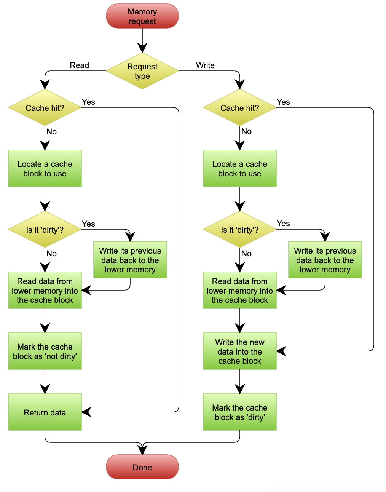
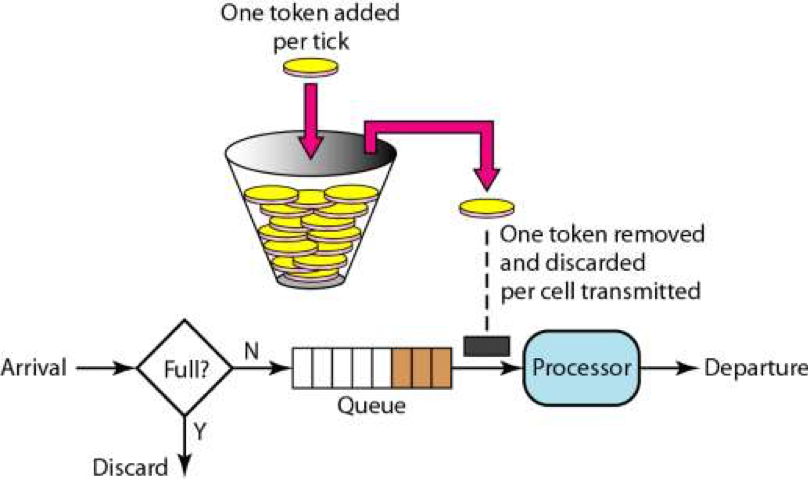

## 性能设计篇之“缓存”
缓存是提高性能最好的方式，一般来说，缓存有以下三种模式。

### Cache Aside 更新模式
这是最常用的设计模式了，其具体逻辑如下。
* **失效**：应用程序先从 Cache 取数据，如果没有得到，则从数据库中取数据，成功后，放到缓存中。
* **命中**：应用程序从 Cache 中取数据，取到后返回。
* **更新**：先把数据存到数据库中，成功后，再让缓存失效。


这是标准的设计模式，包括 Facebook 的论文《Scaling Memcache at Facebook》中也使用了这个策略。为什么不是写完数据库后更新缓存？你可以看一下 Quora 上的这个问答《Why does Facebook use delete to remove the key-value pair in Memcached instead of updating the Memcached during write request to the backend?》，主要是怕两个并发的写操作导致脏数据。

那么，是不是这个 Cache Aside 就不会有并发问题了？不是的。比如，一个是读操作，但是没有命中缓存，就会到数据库中取数据。而此时来了一个写操作，写完数据库后，让缓存失效，然后之前的那个读操作再把老的数据放进去，所以会造成脏数据。

这个案例理论上会出现，但实际上出现的概率可能非常低，因为这个条件需要发生在读缓存时缓存失效，而且有一个并发的写操作。实际上数据库的写操作会比读操作慢得多，而且还要锁表，读操作必须在写操作前进入数据库操作，又要晚于写操作更新缓存，所有这些条件都具备的概率并不大。

所以，这也就是 Quora 上的那个答案里说的，要么通过 2PC 或是 Paxos 协议保证一致性，要么就是拼命地降低并发时脏数据的概率。而 Facebook 使用了这个降低概率的玩法，因为 2PC 太慢，而 Paxos 太复杂。当然，最好还是为缓存设置好过期时间。

### Read/Write Through 更新模式
我们可以看到，在上面的 Cache Aside 套路中，应用代码需要维护两个数据存储，一个是缓存（cache），一个是数据库（repository）。所以，应用程序比较啰嗦。而 Read/Write Through 套路是把更新数据库（repository）的操作由缓存自己代理了，所以，对于应用层来说，就简单很多了。可以理解为，应用认为后端就是一个单一的存储，而存储自己维护自己的 Cache。

### Read Through
Read Through 套路就是在查询操作中更新缓存，也就是说，当缓存失效的时候（过期或 LRU 换出），Cache Aside 是由调用方负责把数据加载入缓存，而 Read Through 则用缓存服务自己来加载，从而对应用方是透明的。

### Write Through
Write Through 套路和 Read Through 相仿，不过是在更新数据时发生。当有数据更新的时候，如果没有命中缓存，直接更新数据库，然后返回。如果命中了缓存，则更新缓存，然后由 Cache 自己更新数据库（这是一个同步操作）。

下图自来 Wikipedia 的 Cache 词条。其中的 Memory，你可以理解为就是我们例子里的数据库。


### Write Behind Caching 更新模式
Write Behind 又叫 Write Back。一些了解 Linux 操作系统内核的同学对 write back 应该非常熟悉，这不就是 Linux 文件系统的 page cache 算法吗？是的，你看基础知识全都是相通的。所以，基础很重要，我已经说过不止一次了。

Write Back 套路就是，在更新数据的时候，只更新缓存，不更新数据库，而我们的缓存会异步地批量更新数据库。这个设计的好处就是让数据的 I/O 操作飞快无比（因为直接操作内存嘛）。因为异步，Write Back 还可以合并对同一个数据的多次操作，所以性能的提高是相当可观的。

但其带来的问题是，数据不是强一致性的，而且可能会丢失（我们知道 Unix/Linux 非正常关机会导致数据丢失，就是因为这个事）。在软件设计上，我们基本上不可能做出一个没有缺陷的设计，就像算法设计中的时间换空间、空间换时间一个道理。有时候，强一致性和高性能，高可用和高性能是有冲突的。软件设计从来都是 trade-off（取舍）。

另外，Write Back 实现逻辑比较复杂，因为它需要 track 有哪些数据是被更新了的，需要刷到持久层上。操作系统的 Write Back 会在仅当这个 Cache 需要失效的时候，才会把它真正持久起来。比如，内存不够了，或是进程退出了等情况，这又叫 lazy write。

在 Wikipedia 上有一张 Write Back 的流程图，基本逻辑可以在下图中看到。


## 弹力设计篇之“认识故障和弹力设计”
为了让你更深入地了解分布式系统，在接下来的几期中，我想谈谈分布式系统中一些比较关键的设计模式，其中包括容错、性能、管理等几个方面。

### 系统可用性测量
对于分布式系统的容错设计，在英文中又叫 Resiliency（弹力）。意思是，系统在不健康、不顺，甚至出错的情况下有能力 hold 得住，挺得住，还有能在这种逆境下力挽狂澜的能力。

要做好一个设计，我们需要一个设计目标，或是一个基准线，通过这个基准线或目标来指导我们的设计，否则在没有明确基准线的指导下，设计会变得非常不明确，并且也不可预测，不可测量。可测试和可测量性是软件设计中非常重要的事情。

我们知道，容错主要是为了可用性，那么，我们是怎样计算一个系统的可用性的呢？下面是一个工业界里使用的一个公式：
```text
Availability = MTTF / (MTTF + MTTRMTTF​)
```
其中，
* MTTF 是 Mean Time To Failure，平均故障前的时间，即系统平均能够正常运行多长时间才发生一次故障。系统的可靠性越高，MTTF 越长。（注意：从字面上来说，看上去有 Failure 的字样，但其实是正常运行的时间。）
* MTTR 是 Mean Time To Recovery，平均修复时间，即从故障出现到故障修复的这段时间，这段时间越短越好。

这个公式就是计算系统可用性的，也就是我们常说的，多少个 9，如下表所示。


根据上面的这个公式，为了提高可用性，我们要么提高系统的无故障时间，要么减少系统的故障恢复时间。

然而，我们要明白，我们运行的是一个分布式系统，对于一个分布式系统来说，要不出故障简直是太难了。

**SLA** SLA(Service Level Agreement)一般指服务级别协议。服务级别协议是指提供服务的企业与客户之间就服务的品质、水准、性能等方面所达成的双方共同认可的协议或契约。

## 弹力设计篇之“隔离设计”
隔离设计对应的单词是 Bulkheads，中文翻译为隔板。但其实，这个术语是用在造船上的，也就是船舱里防漏水的隔板。一般的船无论大小都会有这个东西，大一点的船都会把船舱隔成若干个空间。这样，如果船舱漏水，只会进到一个小空间里，不会让整个船舱都进水而导致整艘船都沉了，如下图所示。


在分布式软件架构中，我们同样需要使用类似的技术来让我们的故障得到隔离。这就需要我们对系统进行分离。一般来说，对于系统的分离有两种方式，一种是以服务的种类来做分离，一种是以用户来做分离。下面具体说明一下这两种方式。

### 按服务的种类来做分离
不同的功能模块进行服务拆分。


上图中，我们将系统分成了用户、商品、社区三个板块。这三个块分别使用不同的域名、服务器和数据库，做到从接入层到应用层再到数据层三层完全隔离。这样一来，在物理上来说，一个板块的故障就不会影响到另一板块。

### 按用户请求来做分离


在这个图中，可以看到，我们将用户分成不同的组，并把后端的同一个服务根据这些不同的组分成不同的实例。让同一个服务对于不同的用户进行冗余和隔离，这样一来，当服务实例挂掉时，只会影响其中一部分用户，而不会导致所有的用户无法访问。


## 弹力设计篇之“熔断设计”
熔断机制这个词对你来说肯定不陌生，它的灵感来源于我们电闸上的“保险丝”，当电压有问题时（比如短路），自动跳闸，此时电路就会断开，我们的电器就会受到保护。不然，会导致电器被烧坏，如果人没在家或是人在熟睡中，还会导致火灾。所以，在电路世界通常都会有这样的自我保护装置。

同样，在我们的分布式系统设计中，也应该有这样的方式。前面说过重试机制，如果错误太多，或是在短时间内得不到修复，那么我们重试也没有意义了，此时应该开启我们的熔断操作，尤其是后端太忙的时候，使用熔断设计可以保护后端不会过载。

### 熔断设计
熔断器模式可以防止应用程序不断地尝试执行可能会失败的操作，使得应用程序继续执行而不用等待修正错误，或者浪费 CPU 时间去等待长时间的超时产生。熔断器模式也可以使应用程序能够诊断错误是否已经修正。如果已经修正，应用程序会再次尝试调用操作。

换句话来说，我觉得熔断器模式就像是那些容易导致错误的操作的一种代理。这种代理能够记录最近调用发生错误的次数，然后决定是继续操作，还是立即返回错误。

熔断器可以使用状态机来实现，内部模拟以下几种状态。
* **闭合（Closed）状态**：我们需要一个调用失败的计数器，如果调用失败，则使失败次数加 1。如果最近失败次数超过了在给定时间内允许失败的阈值，则切换到断开 (Open) 状态。此时开启了一个超时时钟，当该时钟超过了该时间，则切换到半断开（Half-Open）状态。该超时时间的设定是给了系统一次机会来修正导致调用失败的错误，以回到正常工作的状态。在 Closed 状态下，错误计数器是基于时间的。在特定的时间间隔内会自动重置。这能够防止由于某次的偶然错误导致熔断器进入断开状态。也可以基于连续失败的次数。
* **断开 (Open) 状态**：在该状态下，对应用程序的请求会立即返回错误响应，而不调用后端的服务。这样也许比较粗暴，有些时候，我们可以 cache 住上次成功请求，直接返回缓存（当然，这个缓存放在本地内存就好了），如果没有缓存再返回错误（缓存的机制最好用在全站一样的数据，而不是用在不同的用户间不同的数据，因为后者需要缓存的数据有可能会很多）。
* **半开（Half-Open）状态**：允许应用程序一定数量的请求去调用服务。如果这些请求对服务的调用成功，那么可以认为之前导致调用失败的错误已经修正，此时熔断器切换到闭合状态，同时将错误计数器重置。如果这一定数量的请求有调用失败的情况，则认为导致之前调用失败的问题仍然存在，熔断器切回到断开状态，然后重置计时器来给系统一定的时间来修正错误。半断开状态能够有效防止正在恢复中的服务被突然而来的大量请求再次拖垮。


实现熔断器模式使得系统更加稳定和有弹性，在系统从错误中恢复的时候提供稳定性，并且减少了错误对系统性能的影响。它快速地拒绝那些有可能导致错误的服务调用，而不会去等待操作超时或者永远不返回结果来提高系统的响应时间。

如果熔断器设计模式在每次状态切换的时候会发出一个事件，这种信息可以用来监控服务的运行状态，能够通知管理员在熔断器切换到断开状态时进行处理。

### 熔断设计的重点
在实现熔断器模式的时候，以下这些因素需可能需要考虑。
* **错误的类型**。需要注意的是请求失败的原因会有很多种。你需要根据不同的错误情况来调整相应的策略。所以，熔断和重试一样，需要对返回的错误进行识别。一些错误先走重试的策略（比如限流，或是超时），重试几次后再打开熔断。一些错误是远程服务挂掉，恢复时间比较长；这种错误不必走重试，就可以直接打开熔断策略。
* **日志监控**。熔断器应该能够记录所有失败的请求，以及一些可能会尝试成功的请求，使得管理员能够监控使用熔断器保护服务的执行情况。
* **测试服务是否可用**。在断开状态下，熔断器可以采用定期地 ping 一下远程服务的健康检查接口，来判断服务是否恢复，而不是使用计时器来自动切换到半开状态。这样做的一个好处是，在服务恢复的情况下，不需要真实的用户流量就可以把状态从半开状态切回关闭状态。否则在半开状态下，即便服务已恢复了，也需要用户真实的请求来恢复，这会影响用户的真实请求。
* **手动重置**。在系统中对于失败操作的恢复时间是很难确定的，提供一个手动重置功能能够使得管理员可以手动地强制将熔断器切换到闭合状态。同样的，如果受熔断器保护的服务暂时不可用的话，管理员能够强制将熔断器设置为断开状态。
* **并发问题**。相同的熔断器有可能被大量并发请求同时访问。熔断器的实现不应该阻塞并发的请求或者增加每次请求调用的负担。尤其是其中对调用结果的统计，一般来说会成为一个共享的数据结构，它会导致有锁的情况。在这种情况下，最好使用一些无锁的数据结构，或是 atomic 的原子操作。这样会带来更好的性能。
* **资源分区**。有时候，我们会把资源分布在不同的分区上。比如，数据库的分库分表，某个分区可能出现问题，而其它分区还可用。在这种情况下，单一的熔断器会把所有的分区访问给混为一谈，从而，一旦开始熔断，那么所有的分区都会受到熔断影响。或是出现一会儿熔断一会儿又好，来来回回的情况。所以，熔断器需要考虑这样的问题，只对有问题的分区进行熔断，而不是整体。
* **重试错误的请求**。有时候，错误和请求的数据和参数有关系，所以，记录下出错的请求，在半开状态下重试能够准确地知道服务是否真的恢复。当然，这需要被调用端支持幂等调用，否则会出现一个操作被执行多次的副作用。

## 弹力设计篇之“限流设计”
保护系统不会在过载的情况下出现问题，我们就需要限流。

### 限流的策略
限流的目的是通过对并发访问进行限速，相关的策略一般是，一旦达到限制的速率，那么就会触发相应的限流行为。一般来说，触发的限流行为如下。

* **拒绝服务**。把多出来的请求拒绝掉。一般来说，好的限流系统在受到流量暴增时，会统计当前哪个客户端来的请求最多，直接拒掉这个客户端，这种行为可以把一些不正常的或者是带有恶意的高并发访问挡在门外。
* **服务降级**。关闭或是把后端服务做降级处理。这样可以让服务有足够的资源来处理更多的请求。降级有很多方式，一种是把一些不重要的服务给停掉，把 CPU、内存或是数据的资源让给更重要的功能；一种是不再返回全量数据，只返回部分数据。因为全量数据需要做 SQL Join 操作，部分的数据则不需要，所以可以让 SQL 执行更快，还有最快的一种是直接返回预设的缓存，以牺牲一致性的方式来获得更大的性能吞吐。
* **特权请求**。所谓特权请求的意思是，资源不够了，我只能把有限的资源分给重要的用户，比如：分给权利更高的 VIP 用户。在多租户系统下，限流的时候应该保大客户的，所以大客户有特权可以优先处理，而其它的非特权用户就得让路了。
* **延时处理**。在这种情况下，一般会有一个队列来缓冲大量的请求，这个队列如果满了，那么就只能拒绝用户了，如果这个队列中的任务超时了，也要返回系统繁忙的错误了。使用缓冲队列只是为了减缓压力，一般用于应对短暂的峰刺请求。
* **弹性伸缩**。动用自动化运维的方式对相应的服务做自动化的伸缩。这个需要一个应用性能的监控系统，能够感知到目前最繁忙的 TOP 5 的服务是哪几个。然后去伸缩它们，还需要一个自动化的发布、部署和服务注册的运维系统，而且还要快，越快越好。否则，系统会被压死掉了。当然，如果是数据库的压力过大，弹性伸缩应用是没什么用的，这个时候还是应该限流。

### 限流的实现方式
#### 计数器方式
最简单的限流算法就是维护一个计数器 Counter，当一个请求来时，就做加一操作，当一个请求处理完后就做减一操作。如果这个 Counter 大于某个数了（我们设定的限流阈值），那么就开始拒绝请求以保护系统的负载了。

这个算法足够的简单粗暴。

#### 队列算法
在这个算法下，请求的速度可以是波动的，而处理的速度则是非常均速的。这个算法其实有点像一个 FIFO 的算法。


在上面这个 FIFO 的队列上，我们可以扩展出一些别的玩法。

一个是有优先级的队列，处理时先处理高优先级的队列，然后再处理低优先级的队列。 如下图所示，只有高优先级的队列被处理完成后，才会处理低优先级的队列。


有优先级的队列可能会导致低优先级队列长时间得不到处理。为了避免低优先级的队列被饿死，一般来说是分配不同比例的处理时间到不同的队列上，于是我们有了带权重的队列。

如下图所示。有三个队列的权重分布是 3:2:1，这意味着我们需要在权重为 3 的这个队列上处理 3 个请求后，再去权重为 2 的队列上处理 2 个请求，最后再去权重为 1 的队列上处理 1 个请求，如此反复。


队列流控是以队列的的方式来处理请求。如果处理过慢，那么就会导致队列满，而开始触发限流。

但是，这样的算法需要用队列长度来控制流量，在配置上比较难操作。如果队列过长，导致后端服务在队列没有满时就挂掉了。一般来说，这样的模型不能做 push，而是 pull 方式会好一些。

### 漏桶算法 Leaky Bucket
漏斗算法可以参看 Wikipedia 的相关词条 [Leaky Bucket](https://en.wikipedia.org/wiki/Leaky_bucket)。


我们可以看到，就像一个漏斗一样，进来的水量就好像访问流量一样，而出去的水量就像是我们的系统处理请求一样。当访问流量过大时这个漏斗中就会积水，如果水太多了就会溢出。

一般来说，这个“漏斗”是用一个队列来实现的，当请求过多时，队列就会开始积压请求，如果队列满了，就会开拒绝请求。很多系统都有这样的设计，比如 TCP。当请求的数量过多时，就会有一个 sync backlog 的队列来缓冲请求，或是 TCP 的滑动窗口也是用于流控的队列。


我们可以看到，漏斗算法其实就是在队列请求中加上一个限流器，来让 Processor 以一个均匀的速度处理请求。

### 令牌桶算法 Token Bucket
关于令牌桶算法，主要是有一个中间人。在一个桶内按照一定的速率放入一些 token，然后，处理程序要处理请求时，需要拿到 token，才能处理；如果拿不到，则不处理。

下面这个图很清楚地说明了这个算法。



从理论上来说，令牌桶的算法和漏斗算法不一样的是，漏斗算法中，处理请求是以一个常量和恒定的速度处理的，而令牌桶算法则是在流量小的时候“攒钱”，流量大的时候，可以快速处理。

然而，我们可能会问，Processor 的处理速度因为有队列的存在，所以其总是能以最大处理能力来处理请求，这也是我们所希望的方式。因此，令牌桶和漏斗都是受制于 Processor 的最大处理能力。无论令牌桶里有多少令牌，也无论队列中还有多少请求。总之，Processor 在大流量来临时总是按照自己最大的处理能力来处理的。

但是，试想一下，如果我们的 Processor 只是一个非常简单的任务分配器，比如像 Nginx 这样的基本没有什么业务逻辑的网关，那么它的处理速度一定很快，不会有什么瓶颈，而其用来把请求转发给后端服务，那么在这种情况下，这两个算法就有不一样的情况了。

漏斗算法会以一个稳定的速度转发，而令牌桶算法平时流量不大时在“攒钱”，流量大时，可以一次发出队列里有的请求，而后就受到令牌桶的流控限制。

另外，令牌桶还可能做成第三方的一个服务，这样可以在分布式的系统中对全局进行流控，这也是一个很好的方式。

### 基于响应时间的动态限流
上面的算法有个不好的地方，就是需要设置一个确定的限流值。这就要求我们每次发布服务时都做相应的性能测试，找到系统最大的性能值。

然而，在很多时候，我们却并不知道这个限流值，或是很难给出一个合适的值。其基本会有如下的一些因素：

* 实际情况下，很多服务会依赖于数据库。所以，不同的用户请求，会对不同的数据集进行操作。就算是相同的请求，可能数据集也不一样，比如，现在很多应用都会有一个时间线 Feed 流，不同的用户关心的主题人人不一样，数据也不一样。而且数据库的数据是在不断变化的，可能前两天性能还行，因为数据量增加导致性能变差。在这种情况下，我们很难给出一个确定的一成不变的值，因为关系型数据库对于同一条 SQL 语句的执行时间其实是不可预测的（NoSQL 的就比 RDBMS 的可预测性要好）。
* 不同的 API 有不同的性能。我们要在线上为每一个 API 配置不同的限流值，这点太难配置，也很难管理。
* 而且，现在的服务都是能自动化伸缩的，不同大小的集群的性能也不一样，所以，在自动化伸缩的情况下，我们要动态地调整限流的阈值，这点太难做到了。

基于上述这些原因，我们限流的值是很难被静态地设置成恒定的一个值。

我们想使用一种动态限流的方式。这种方式，不再设定一个特定的流控值，而是能够动态地感知系统的压力来自动化地限流。

这方面设计的典范是 TCP 协议的拥塞控制的算法。TCP 使用 RTT - Round Trip Time 来探测网络的延时和性能，从而设定相应的“滑动窗口”的大小，以让发送的速率和网络的性能相匹配。这个算法是非常精妙的，我们完全可以借鉴在我们的流控技术中。

我们记录下每次调用后端请求的响应时间，然后在一个时间区间内（比如，过去 10 秒）的请求计算一个响应时间的 P90 或 P99 值，也就是把过去 10 秒内的请求的响应时间排个序，然后看 90% 或 99% 的位置是多少。

这样，我们就知道有多少请求大于某个响应时间。如果这个 P90 或 P99 超过我们设定的阈值，那么我们就自动限流。

这个设计中有几个要点。

* 你需要计算的一定时间内的 P90 或 P99。在有大量请求的情况下，这个非常地耗内存也非常地耗 CPU，因为需要对大量的数据进行排序。解决方案有两种，一种是不记录所有的请求，采样就好了，另一种是使用一个叫蓄水池的近似算法。关于这个算法这里我不就多说了，《编程珠玑》里讲过这个算法，你也可以自行 Google，英文叫 Reservoir Sampling。
* 这种动态流控需要像 TCP 那样，你需要记录一个当前的 QPS. 如果发现后端的 P90/P99 响应太慢，那么就可以把这个 QPS 减半，然后像 TCP 一样走慢启动的方式，直接到又开始变慢，然后减去 1/4 的 QPS，再慢启动，然后再减去 1/8 的 QPS……这个过程有点像个阻尼运行的过程，然后整个限流的流量会在一个值上下做小幅振动。这么做的目的是，如果后端扩容伸缩后性能变好，系统会自动适应后端的最大性能。
* 这种动态限流的方式实现起来并不容易。大家可以看一下 TCP 的算法。TCP 相关的一些算法，我写在了 CoolShell 上的《TCP 的那些事（下）》这篇文章中。你可以用来做参考来实现。

### 限流的设计要点
限流主要是有四个目的。

1. 为了向用户承诺 SLA。我们保证我们的系统在某个速度下的响应时间以及可用性。
2. 同时，也可以用来阻止在多租户的情况下，某一用户把资源耗尽而让所有的用户都无法访问的问题。
3. 为了应对突发的流量。
4. 节约成本。我们不会为了一个不常见的尖峰来把我们的系统扩容到最大的尺寸。而是在有限的资源下能够承受比较高的流量。

在设计上，我们还要有以下的考量。
1. 限流应该是在架构的早期考虑。当架构形成后，限流不是很容易加入。
2. 限流模块性能必须好，而且对流量的变化也是非常灵敏的，否则太过迟钝的限流，系统早因为过载而挂掉了。
3. 限流应该有个手动的开关，这样在应急的时候，可以手动操作。
4. 当限流发生时，应该有个监控事件通知。让我们知道有限流事件发生，这样，运维人员可以及时跟进。而且还可以自动化触发扩容或降级，以缓解系统压力。
5. 当限流发生时，对于拒掉的请求，我们应该返回一个特定的限流错误码。这样，可以和其它错误区分开来。而客户端看到限流，可以调整发送速度，或是走重试机制。
6. 限流应该让后端的服务感知到。限流发生时，我们应该在协议头中塞进一个标识，比如 HTTP Header 中，放入一个限流的级别，告诉后端服务目前正在限流中。这样，后端服务可以根据这个标识决定是否做降级。

## 弹力设计篇之“降级设计”
所谓的降级设计（Degradation），本质是为了解决资源不足和访问量过大的问题。当资源和访问量出现矛盾的时候，在有限的资源下，为了能够扛住大量的请求，我们就需要对系统进行降级操作。也就是说，暂时牺牲掉一些东西，以保障整个系统的平稳运行。

一般来说，我们的降级需要牺牲掉的东西有：
* **降低一致性**。从强一致性变成最终一致性。
* **停止次要功能**。停止访问不重要的功能，从而释放出更多的资源。
* **简化功能**。把一些功能简化掉，比如，简化业务流程，或是不再返回全量数据，只返回部分数据。

### 降低一致性
我们要清楚地认识到，这世界上大多数系统并不是都需要强一致性的。对于降低一致性，把强一致性变成最终一致性的做法可以有效地释放资源，并且让系统运行得更快，从而可以扛住更大的流量。一般来说，会有两种做法，一种是简化流程的一致性，一种是降低数据的一致性。

### 使用异步简化流程

### 降低数据的一致性
降低数据的一致性一般来说会使用缓存的方式，或是直接就去掉数据。比如，在页面上不显示库存的具体数字，只显示有还是没有库存这两种状态。

对于缓存来说，可以有效地降低数据库的压力，把数据库的资源交给更重要的业务，这样就能让系统更快速地运行。

### 停止次要的功能
停止次要的功能也是一种非常有用的策略。把一些不重要的功能给暂时停止掉，让系统释放出更多的资源来。比如，电商中的搜索功能，用户的评论功能，等等。等待访问的峰值过去后，我们再把这些功能给恢复回来。

当然，最好不要停止次要的功能，首先可以限制次要的功能的流量，或是把次要的功能退化成简单的功能，最后如果量太大了，我们才会进入停止功能的状态。

停止功能对用户会带来一些用户体验的问题，尤其是要停掉一些可能对于用户来说是非常重要的功能。所以，如果可能，最好给用户一些补偿，比如把用户切换到一个送积分卡，或是红包抽奖的网页上，有限地补偿一下用户。

### 简化功能
关于功能的简化上，上面的下单流程中已经提到过相应的例子了。而且，从缓存中返回数据也是其中一个。这里再提一个，就是一般来说，一个 API 会有两个版本，一个版本返回全量数据，另一个版本只返回部分或最小的可用的数据。

举个例子，对于一篇文章，一个 API 会把商品详情页或文章的内容和所有的评论都返回到前端。那么在降级的情况下，我们就只返回商品信息和文章内容，而不返回用户评论了，因为用户评论会涉及更多的数据库操作。

所以，这样可以释放更多的数据资源。而商品信息或文章信息可以放在缓存中，这样又能释放出更多的资源给交易系统这样的需要更多数据库资源的业务使用。

### 降级设计的要点
对于降级，一般来说是要牺牲业务功能或是流程，以及一致性的。所以，我们需要对业务做非常仔细的梳理和分析。我们很难通过不侵入业务的方式来做到功能降级。

在设计降级的时候，需要清楚地定义好降级的关键条件，比如，吞吐量过大、响应时间过慢、失败次数多过，有网络或是服务故障，等等，然后做好相应的应急预案。这些预案最好是写成代码可以快速地自动化或半自动化执行的。

功能降级需要梳理业务的功能，哪些是 must-have 的功能，哪些是 nice-to-have 的功能；哪些是必须要死保的功能，哪些是可以牺牲的功能。而且需要在事前设计好可以简化的或是用来应急的业务流程。当系统出问题的时候，就需要走简化应急流程。

降级的时候，需要牺牲掉一致性，或是一些业务流程：对于读操作来说，使用缓存来解决，对于写操作来说，需要异步调用来解决。并且，我们需要以流水账的方式记录下来，这样方便对账，以免漏掉或是和正常的流程混淆。

降级的功能的开关可以是一个系统的配置开关。做成配置时，你需要在要降级的时候推送相应的配置。另一种方式是，在对外服务的 API 上有所区分（方法签名或是开关参数），这样可以由上游调用者来驱动。

# 高效学习

## 高效学习：端正学习态度
怎样进行深度学习呢？下面几点是关键。

1. 高质量的信息源和第一手的知识。
2. 把知识连成地图，将自己的理解反述出来。
3. 不断地反思和思辨，与不同年龄段的人讨论。
4. 举一反三，并践行之，把知识转换成技能。

换言之，学习有三个步骤。

1. 知识采集。信息源是非常重要的，获取信息源头、破解表面信息的内在本质、多方数据印证，是这个步骤的关键。
2. 知识缝合。所谓缝合就是把信息组织起来，成为结构体的知识。这里，连接记忆，逻辑推理，知识梳理是很重要的三部分。
3. 技能转换。通过举一反三、实践和练习，以及传授教导，把知识转化成自己的技能。这种技能可以让你进入更高的阶层。

## 高效学习：源头、原理和知识地图

## 高效学习：深度、归纳和坚持实践

## 高效学习：如何学习和阅读源码

## 高效学习：面对枯燥和量大的学习