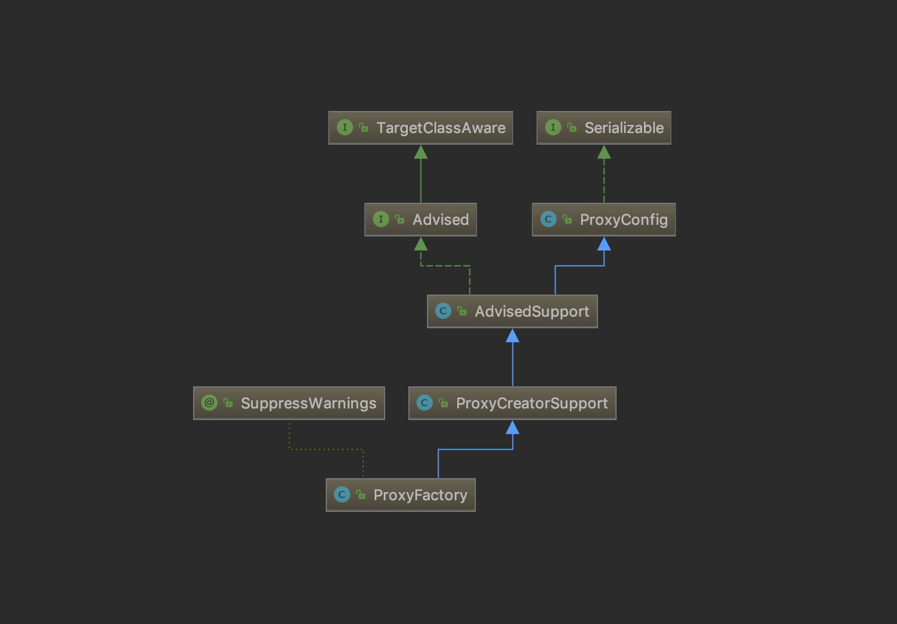
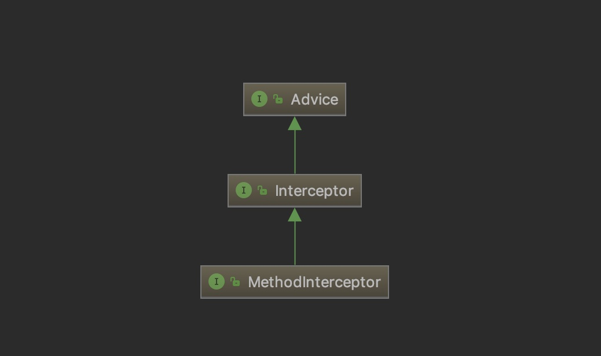

# SpringAOP 

### TargetClassAware 接口
`TargetClassAware` 是一个很顶层的接口，可以通过该接口的 `getTargetClass` 方法，获取代理类中目标类的 Class

### TargetSource 接口
`TargetSource` 是代理目标类的包装类，拥有获取代理目标对象的方法，属于AOP框架中的内部接口，开发人员一般不会直接用到。

### Advised 接口
接口由保存AOP代理工厂配置的类实现。此配置包括拦截器和其他通知、增强器和代理接口。

### ProxyConfig 类
创建代理的配置类，确保所有代理创建者具有一致的属性。

### Advice
表示一个增强，没有任何需要实现的方法，相当于一个tag

### Advisor
"顾问"，可以从中获取 Advice

### AdvisedSupport 类
AOP代理配置管理器的基类。这些它们本身不是AOP代理，但此类的子类通常是直接从中获取AOP代理实例的工厂。

1. 配置当前代理的Adivsiors
2. 配置当前代理的目标对象
3. 配置当前代理的接口
4. 提供 `getInterceptorsAndDynamicInterceptionAdvice` 方法用来获取对应代理方法对应有效的拦截器链

> AdvisedSupport本身不会提供创建代理的任何方法，专注于生成拦截器链

有几个非常重要的变量：

* targetSource 是代理对象的包装类
* advisorChainFactory 默认实现是 `DefaultAdvisorChainFactory`，只有一个方法 `getInterceptorsAndDynamicInterceptionAdvice`
* methodCache 是一个并发map，缓存方法到advisor链的映射
* interfaces 持有代理实现的所有接口，保留在List中以保持注册顺序，以指定的接口顺序创建JDK代理。
* advisors advisor链表，如果添加了advice将其添加在Advisor中，然后又回添加到此列表中
* advisorArray 正如其名是一个数组，和advisors保持同步


现在来讲一下第4点，它是怎么获取拦截器链的：
```java
public class AdvisedSupport extends ProxyConfig implements Advised {
    /**
     * No-arg constructor for use as a JavaBean.
     */
    public AdvisedSupport() {
        // 构造函数中初始化了 methodCache
        initMethodCache();
    }

	/**
	 * Initialize the method cache.
	 */
	private void initMethodCache() {
		this.methodCache = new ConcurrentHashMap<MethodCacheKey, List<Object>>(32);
	}
	
    /**
     * Determine a list of {@link org.aopalliance.intercept.MethodInterceptor} objects
     * for the given method, based on this configuration.
     * 基于配置，获取方法最终的拦截器链
     * 
     * @param method the proxied method
     * @param targetClass the target class
     * @return List of MethodInterceptors (may also include InterceptorAndDynamicMethodMatchers)
     */
    public List<Object> getInterceptorsAndDynamicInterceptionAdvice(Method method, Class<?> targetClass) {
        // 通过方法获取一个MethodCacheKey包装类
        MethodCacheKey cacheKey = new MethodCacheKey(method);
        // 第一步是从缓存中获取拦截器链
        List<Object> cached = this.methodCache.get(cacheKey);
        if (cached == null) {
            // 获取不到则通过 advisorChainFactory 创建一条
            cached = this.advisorChainFactory.getInterceptorsAndDynamicInterceptionAdvice(
                    this, method, targetClass);
            // 将创建的拦截器链放入缓存
            this.methodCache.put(cacheKey, cached);
        }
        return cached;
    }
	
}

// 下面跳转到默认Advisor链工厂，看看是怎么获取拦截器链的
public class DefaultAdvisorChainFactory implements AdvisorChainFactory, Serializable {

	@Override
	public List<Object> getInterceptorsAndDynamicInterceptionAdvice(
			Advised config, Method method, Class<?> targetClass) {

		// This is somewhat tricky... We have to process introductions first,
		// but we need to preserve order in the ultimate list.
		List<Object> interceptorList = new ArrayList<Object>(config.getAdvisors().length);
		Class<?> actualClass = (targetClass != null ? targetClass : method.getDeclaringClass());
		boolean hasIntroductions = hasMatchingIntroductions(config, actualClass);
		AdvisorAdapterRegistry registry = GlobalAdvisorAdapterRegistry.getInstance();

        // 从配置中获取advisor列表
		for (Advisor advisor : config.getAdvisors()) {
		    // 如果是切入点则需要判断切入点是否能match上
			if (advisor instanceof PointcutAdvisor) {
				// 有条件的添加
				PointcutAdvisor pointcutAdvisor = (PointcutAdvisor) advisor;
				if (config.isPreFiltered() || pointcutAdvisor.getPointcut().getClassFilter().matches(actualClass)) {
				    // 从注册器中获取拦截器
				    MethodInterceptor[] interceptors = registry.getInterceptors(advisor);
					MethodMatcher mm = pointcutAdvisor.getPointcut().getMethodMatcher();
					// 匹配当前方法是否符合切入点
					if (MethodMatchers.matches(mm, method, actualClass, hasIntroductions)) {
						if (mm.isRuntime()) {
							// Creating a new object instance in the getInterceptors() method
							// isn't a problem as we normally cache created chains.
							for (MethodInterceptor interceptor : interceptors) {
								interceptorList.add(new InterceptorAndDynamicMethodMatcher(interceptor, mm));
							}
						} else {
							interceptorList.addAll(Arrays.asList(interceptors));
						}
					}
				}
			} else if (advisor instanceof IntroductionAdvisor) {
				IntroductionAdvisor ia = (IntroductionAdvisor) advisor;
				if (config.isPreFiltered() || ia.getClassFilter().matches(actualClass)) {
					Interceptor[] interceptors = registry.getInterceptors(advisor);
					interceptorList.addAll(Arrays.asList(interceptors));
				}
			} else {
				Interceptor[] interceptors = registry.getInterceptors(advisor);
				interceptorList.addAll(Arrays.asList(interceptors));
			}
		}

		return interceptorList;
	}
}
```

### ProxyCreatorSupport 类
代理工厂的基类，提供对可配置AopProxyFactory的便捷访问。
有三个变量：

1. aopProxyFactory AOP代理工厂类，默认实现是 DefaultAopProxyFactory
2. listeners 监听器，代理被激活后会触发监听器
3. active 当创建第一个代理时会被设置成true

### ProxyFactory 类


代理工厂类，主要方法是 `getProxy`，创建并返回代理类。

### Pointcut 接口
核心Spring切入点抽象。
切入点由 `ClassFilter` 和 `MethodMatcher` 组成。

说白了，切入点就是一个抽象，来表示哪个类或哪个方法是否需要被增强。

```java
public interface Pointcut {

	/**
	 * Return the ClassFilter for this pointcut.
	 * 返回该切入点的 ClassFilter
	 * @return the ClassFilter (never {@code null})
	 */
	ClassFilter getClassFilter();

	/**
	 * Return the MethodMatcher for this pointcut.
	 * 返回该切入点的 MethodMatcher
	 * @return the MethodMatcher (never {@code null})
	 */
	MethodMatcher getMethodMatcher();


	/**
	 * Canonical Pointcut instance that always matches.
	 * 公认的切入点（总是匹配）
	 */
	Pointcut TRUE = TruePointcut.INSTANCE;

}
```
### ClassFilter 接口

```java
public interface ClassFilter {

	/**
	 * Should the pointcut apply to the given interface or target class?
	 * 切入点应该应用于给定的接口或目标类吗？
	 * 
	 * @param clazz the candidate target class
	 * @return whether the advice should apply to the given target class
	 */
	boolean matches(Class<?> clazz);


	/**
	 * Canonical instance of a ClassFilter that matches all classes.
	 */
	ClassFilter TRUE = TrueClassFilter.INSTANCE;

}
```

### MethodMatcher 接口

```java
public interface MethodMatcher {

	/**
	 * 执行静态检查，给定的方法是否匹配。
	 * 
	 * Perform static checking whether the given method matches. If this
	 * returns {@code false} or if the {@link #isRuntime()} method
	 * returns {@code false}, no runtime check (i.e. no.
	 * {@link #matches(java.lang.reflect.Method, Class, Object[])} call) will be made.
	 * @param method the candidate method
	 * @param targetClass the target class (may be {@code null}, in which case
	 * the candidate class must be taken to be the method's declaring class)
	 * @return whether or not this method matches statically
	 */
	boolean matches(Method method, Class<?> targetClass);

	/**
	 * 是否需要运行时每次都调用匹配方法? 
	 * 1. 如果需要的话就调用三个参数的 matches 方法（根据参数来判断是否需要增强）
	 * 2. 如果不需要就调用两个参数的 matches 方法
	 * 
	 * Is this MethodMatcher dynamic, that is, must a final call be made on the
	 * {@link #matches(java.lang.reflect.Method, Class, Object[])} method at
	 * runtime even if the 2-arg matches method returns {@code true}?
	 * <p>Can be invoked when an AOP proxy is created, and need not be invoked
	 * again before each method invocation,
	 * @return whether or not a runtime match via the 3-arg
	 * {@link #matches(java.lang.reflect.Method, Class, Object[])} method
	 * is required if static matching passed
	 */
	boolean isRuntime();

	/**
	 * 执行动态检查给定的方法是否匹配
	 * 
	 * Check whether there a runtime (dynamic) match for this method,
	 * which must have matched statically.
	 * <p>This method is invoked only if the 2-arg matches method returns
	 * {@code true} for the given method and target class, and if the
	 * {@link #isRuntime()} method returns {@code true}. Invoked
	 * immediately before potential running of the advice, after any
	 * advice earlier in the advice chain has run.
	 * @param method the candidate method
	 * @param targetClass the target class (may be {@code null}, in which case
	 * the candidate class must be taken to be the method's declaring class)
	 * @param args arguments to the method
	 * @return whether there's a runtime match
	 * @see MethodMatcher#matches(Method, Class)
	 */
	boolean matches(Method method, Class<?> targetClass, Object... args);


	/**
	 * Canonical instance that matches all methods.
	 */
	MethodMatcher TRUE = TrueMethodMatcher.INSTANCE;

}
```

### StaticMethodMatcher 类
看了上面的 MethodMatcher 就知道，这个类就是一个静态方法匹配器。
方便的抽象超类，用于静态方法匹配器，它们在运行时不关心参数。

### StaticMethodMatcherPointcut 类
同样，这个切入点就是匹配当前类且基于方法静态匹配的切入点。

### Interceptor 接口
该类只是一个标记类，该接口没有方法需要实现。

### Joinpoint 接口
表示连接点。一般实现类为 ReflectiveMethodInvocation

```java
public interface Joinpoint {

	/**
	 * 处理拦截器链中的下一个拦截器
	 * 
	 * Proceed to the next interceptor in the chain.
	 * 
	 * 此方法的实现和语义取决于实际的连接点类型（请参见子接口）
	 * 
	 * <p>The implementation and the semantics of this method depends
	 * on the actual joinpoint type (see the children interfaces).
	 * @return see the children interfaces' proceed definition
	 * @throws Throwable if the joinpoint throws an exception
	 */
	Object proceed() throws Throwable;

	/**
	 * 返回保存当前联接点的静态部分的对象。
	 * 
	 * Return the object that holds the current joinpoint's static part.
	 * 
	 * 例如，调用的目标对象。
	 * <p>For instance, the target object for an invocation.
	 * @return the object (can be null if the accessible object is static)
	 */
	Object getThis();

	/**
	 * 返回此连接点的静态部分。（ReflectiveMethodInvocation 实现了该方法返回的是 Method）
	 * 
	 * Return the static part of this joinpoint.
	 * 
	 * 静态部分是可访问对象，在该对象上安装了一系列拦截器。
	 * <p>The static part is an accessible object on which a chain of
	 * interceptors are installed.
	 */
	AccessibleObject getStaticPart();

}

```

### Invocation 接口
该接口表示程序中的调用。

```java
public interface Invocation extends Joinpoint {

	/**
	 * 获取调用参数数组，可以更改此数组中的元素值以更改参数。
	 * 
	 * Get the arguments as an array object.
	 * It is possible to change element values within this
	 * array to change the arguments.
	 * @return the argument of the invocation
	 */
	Object[] getArguments();

}
```

### MethodInvocation 接口
方法调用的描述，在方法调用时提供给拦截器。

```java
/**
 * 方法调用的描述，在方法调用时提供给拦截器。 
 * Description of an invocation to a method, given to an interceptor
 * upon method-call.
 * 
 * 方法调用是一个连接点，可以被方法拦截器拦截。
 * <p>A method invocation is a joinpoint and can be intercepted by a
 * method interceptor.
 *
 * @author Rod Johnson
 * @see MethodInterceptor
 */
public interface MethodInvocation extends Invocation {

	/**
	 * 获取被调用的方法
	 * Get the method being called.
	 * 
	 * 该方法是 Joinpoint#getStaticPart的友好实现（结果相同）
	 * <p>This method is a frienly implementation of the
	 * {@link Joinpoint#getStaticPart()} method (same result).
	 * @return the method being called
	 */
	Method getMethod();

}
```

### MethodInterceptor 接口


```java
public interface MethodInterceptor extends Interceptor {
	
	/**
	 * 实现此方法以在调用之前和之后执行额外的处理。
	 * 礼貌的实现当然希望调用{@link Joinpoint＃proceed（）}。
	 * 
	 * Implement this method to perform extra treatments before and
	 * after the invocation. Polite implementations would certainly
	 * like to invoke {@link Joinpoint#proceed()}.
	 * @param invocation the method invocation joinpoint
	 * @return the result of the call to {@link Joinpoint#proceed()};
	 * might be intercepted by the interceptor
	 * @throws Throwable if the interceptors or the target object
	 * throws an exception
	 */
	Object invoke(MethodInvocation invocation) throws Throwable;

}
```

### JdkDynamicAopProxy 源码分析
```java
// 我们发现它自己就实现了了InvocationHandler，所以处理器就是它自己。会实现invoke方法
// 它还是个final类  默认是包的访问权限
final class JdkDynamicAopProxy implements AopProxy, InvocationHandler, Serializable {

	private static final Log logger = LogFactory.getLog(JdkDynamicAopProxy.class);

	/** 这里就保存这个AOP代理所有的配置信息  包括所有的增强器等等 */
	private final AdvisedSupport advised;

	// 标记equals方法和hashCode方法是否定义在了接口上=====
	private boolean equalsDefined;
	private boolean hashCodeDefined;

	public JdkDynamicAopProxy(AdvisedSupport config) throws AopConfigException {
		Assert.notNull(config, "AdvisedSupport must not be null");
		// 内部再校验一次：必须有至少一个增强器  和  目标实例才行
		if (config.getAdvisors().length == 0 && config.getTargetSource() == AdvisedSupport.EMPTY_TARGET_SOURCE) {
			throw new AopConfigException("No advisors and no TargetSource specified");
		}
		this.advised = config;
	}


	@Override
	public Object getProxy() {
		return getProxy(ClassUtils.getDefaultClassLoader());
	}

	// 真正创建JDK动态代理实例的地方
	@Override
	public Object getProxy(@Nullable ClassLoader classLoader) {
		if (logger.isDebugEnabled()) {
			logger.debug("Creating JDK dynamic proxy: target source is " + this.advised.getTargetSource());
		}
		// 这部很重要，就是去找接口 我们看到最终代理的接口就是这里返回的所有接口们（除了我们自己的接口，还有Spring默认的一些接口）  大致过程如下：
		//1、获取目标对象自己实现的接口们(最终肯定都会被代理的)
		//2、是否添加`SpringProxy`这个接口：目标对象实现对就不添加了，没实现过就添加true
		//3、是否新增`Adviced`接口，注意不是Advice通知接口。 实现过就不实现了，没实现过并且advised.isOpaque()=false就添加（默认是会添加的）
		//4、是否新增DecoratingProxy接口。传入的参数decoratingProxy为true，并且没实现过就添加（显然这里，首次进来是会添加的）
		//5、代理类的接口一共是目标对象的接口+上面三个接口SpringProxy、Advised、DecoratingProxy（SpringProxy是个标记接口而已，其余的接口都有对应的方法的）
		//DecoratingProxy 这个接口Spring4.3后才提供
		Class<?>[] proxiedInterfaces = AopProxyUtils.completeProxiedInterfaces(this.advised, true);
		findDefinedEqualsAndHashCodeMethods(proxiedInterfaces);
		// 第三个参数传的this，处理器就是自己嘛   到此一个代理对象就此new出来啦
		return Proxy.newProxyInstance(classLoader, proxiedInterfaces, this);
	}

	// 找找看看接口里有没有自己定义equals方法和hashCode方法，这个很重要  然后标记一下
	// 注意此处用的是getDeclaredMethods，只会找自己的
	private void findDefinedEqualsAndHashCodeMethods(Class<?>[] proxiedInterfaces) {
		for (Class<?> proxiedInterface : proxiedInterfaces) {
			Method[] methods = proxiedInterface.getDeclaredMethods();
			for (Method method : methods) {
				if (AopUtils.isEqualsMethod(method)) {
					this.equalsDefined = true;
				}
				if (AopUtils.isHashCodeMethod(method)) {
					this.hashCodeDefined = true;
				}
				// 小技巧：两个都找到了 就没必要继续循环勒
				if (this.equalsDefined && this.hashCodeDefined) {
					return;
				}
			}
		}
	}

	 // 对于这部分代码和采用CGLIB的大部分逻辑都是一样的，Spring对此的解释很有意思：
	 // 本来是可以抽取出来的，使得代码看起来更优雅。但是因为此会带来10%得性能损耗，所以Spring最终采用了粘贴复制的方式各用一份
	 // Spring说它提供了基础的套件，来保证两个的执行行为是一致的。
	 //proxy:指的是我们所代理的那个真实的对象；method:指的是我们所代理的那个真实对象的某个方法的Method对象args:指的是调用那个真实对象方法的参数。

	// 此处重点分析一下此方法，这样在CGLIB的时候，就可以一带而过了~~~因为大致逻辑是一样的
	@Override
	@Nullable
	public Object invoke(Object proxy, Method method, Object[] args) throws Throwable {
		// 它是org.aopalliance.intercept这个包下的  AOP联盟得标准接口
		MethodInvocation invocation;
		Object oldProxy = null;
		boolean setProxyContext = false;

		// 进入invoke方法后，最终操作的是targetSource对象
		// 因为InvocationHandler持久的就是targetSource，最终通过getTarget拿到目标对象
		TargetSource targetSource = this.advised.targetSource;
		Object target = null;

		try {
			//“通常情况”Spring AOP不会对equals、hashCode方法进行拦截增强,所以此处做了处理
			// equalsDefined为false（表示自己没有定义过eequals方法）  那就交给代理去比较
			// hashCode同理，只要你自己没有实现过此方法，那就交给代理吧
			// 需要注意的是：这里统一指的是，如果接口上有此方法，但是你自己并没有实现equals和hashCode方法，那就走AOP这里的实现
			// 如国接口上没有定义此方法，只是实现类里自己@Override了HashCode，那是无效的，就是普通执行吧
			if (!this.equalsDefined && AopUtils.isEqualsMethod(method)) {
				return equals(args[0]);
			}
			else if (!this.hashCodeDefined && AopUtils.isHashCodeMethod(method)) {
				return hashCode();
			}


			// 下面两段做了很有意思的处理：DecoratingProxy的方法和Advised接口的方法  都是是最终调用了config，也就是this.advised去执行的~~~~
			else if (method.getDeclaringClass() == DecoratingProxy.class) {
				// There is only getDecoratedClass() declared -> dispatch to proxy config.
				return AopProxyUtils.ultimateTargetClass(this.advised);
			}
			else if (!this.advised.opaque && method.getDeclaringClass().isInterface() &&
					method.getDeclaringClass().isAssignableFrom(Advised.class)) {
				// Service invocations on ProxyConfig with the proxy config...
				return AopUtils.invokeJoinpointUsingReflection(this.advised, method, args);
			}
			
			// 这个是最终该方法的返回值~~~~
			Object retVal;

			//是否暴露代理对象，默认false可配置为true，如果暴露就意味着允许在线程内共享代理对象，
			//注意这是在线程内，也就是说同一线程的任意地方都能通过AopContext获取该代理对象，这应该算是比较高级一点的用法了。
			// 这里缓存一份代理对象在oldProxy里~~~后面有用
			if (this.advised.exposeProxy) {
				oldProxy = AopContext.setCurrentProxy(proxy);
				setProxyContext = true;
			}

			//通过目标源获取目标对象 (此处Spring建议获取目标对象靠后获取  而不是放在上面) 
			target = targetSource.getTarget();
			Class<?> targetClass = (target != null ? target.getClass() : null);

			// 获取作用在这个方法上的所有拦截器链~~~  参见DefaultAdvisorChainFactory#getInterceptorsAndDynamicInterceptionAdvice方法
			// 会根据切点表达式去匹配这个方法。因此其实每个方法都会进入这里，只是有很多方法得chain事Empty而已
			List<Object> chain = this.advised.getInterceptorsAndDynamicInterceptionAdvice(method, targetClass);

		
			if (chain.isEmpty()) {
				// 若拦截器为空，那就直接调用目标方法了
				// 对参数进行适配：主要处理一些数组类型的参数，看是表示一个参数  还是表示多个参数（可变参数最终到此都是数组类型，所以最好是需要一次适配）
				Object[] argsToUse = AopProxyUtils.adaptArgumentsIfNecessary(method, args);
				// 这句代码的意思是直接调用目标方法~~~
				retVal = AopUtils.invokeJoinpointUsingReflection(target, method, argsToUse);
			}
			else {
				// 创建一个invocation ，此处为ReflectiveMethodInvocation  最终是通过它，去执行前置加强、后置加强等等逻辑
				invocation = new ReflectiveMethodInvocation(proxy, target, method, args, targetClass, chain);
				// 此处会执行所有的拦截器链  交给AOP联盟的MethodInvocation去处理。当然实现还是我们Spring得ReflectiveMethodInvocation
				retVal = invocation.proceed();
			}

			// 获取返回值的类型
			Class<?> returnType = method.getReturnType();
			if (retVal != null && retVal == target &&
					returnType != Object.class && returnType.isInstance(proxy) &&
					!RawTargetAccess.class.isAssignableFrom(method.getDeclaringClass())) {
				 // 一些列的判断条件，如果返回值不为空，且为目标对象的话，就直接将目标对象赋值给retVal
				retVal = proxy;
			}
			// 返回null，并且还不是Void类型。。。抛错
			else if (retVal == null && returnType != Void.TYPE && returnType.isPrimitive()) {
				throw new AopInvocationException(
						"Null return value from advice does not match primitive return type for: " + method);
			}
			return retVal;
		}
		finally {
			// 释放~~
			if (target != null && !targetSource.isStatic()) {
				targetSource.releaseTarget(target);
			}

			// 把老的代理对象重新set进去~~~
			if (setProxyContext) {
				AopContext.setCurrentProxy(oldProxy);
			}
		}
	}

	// AOP帮我们实现的CgLib方法
	@Override
	public boolean equals(@Nullable Object other) {
		if (other == this) {
			return true;
		}
		if (other == null) {
			return false;
		}

		JdkDynamicAopProxy otherProxy;
		if (other instanceof JdkDynamicAopProxy) {
			otherProxy = (JdkDynamicAopProxy) other;
		}
		else if (Proxy.isProxyClass(other.getClass())) {
			InvocationHandler ih = Proxy.getInvocationHandler(other);
			if (!(ih instanceof JdkDynamicAopProxy)) {
				return false;
			}
			otherProxy = (JdkDynamicAopProxy) ih;
		}
		else {
			// Not a valid comparison...
			return false;
		}

		// If we get here, otherProxy is the other AopProxy.
		return AopProxyUtils.equalsInProxy(this.advised, otherProxy.advised);
	}

	// AOP帮我们实现的HashCode方法
	@Override
	public int hashCode() {
		return JdkDynamicAopProxy.class.hashCode() * 13 + this.advised.getTargetSource().hashCode();
	}

}
```

# 扩展
> [JDK动态代理技术，你真学会了吗？](https://blog.csdn.net/f641385712/article/details/89362021)
> [详解Spring AOP的底层代理JdkDynamicAopProxy和ObjenesisCglibAopProxy的源码分析](https://blog.csdn.net/f641385712/article/details/88952482)
> [探索Spring AOP中aopalliance的Joinpoint、MethodInvocation、Interceptor、MethodInterceptor](https://blog.csdn.net/f641385712/article/details/88975543)

