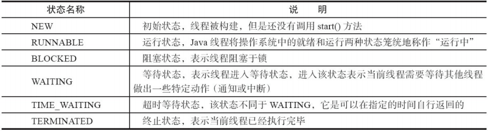

# 最近在看的东西
[Java面试总结](https://github.com/Snailclimb/JavaGuide)

# AQS
什么是AQS？
AQS是AbstractQueuedSynchronizer的缩写，抽象队列同步器。
通过它的名字就大概可以知道它的核心是同步队列，并且是不能直接使用的，一般由子类继承实现不同的功能。

> [java AQS的实现原理](https://www.jianshu.com/p/279baac48960)

看完了上面的文章，建议看完这个人的博客：https://www.jianshu.com/u/81e00c67166c


## 总结AQS的基本原理？
AQS实现的基本原理有三点：
1. CAS（比较并交换 compare and swap），由sun.misc.Unsafe类提供。
2. 自旋，本质是有限次尝试，尽可能不进行线程切换。
3. 线程的 park 和 unpark，同样是由sun.misc.Unsafe类提供。 

## CAS
CAS（Compare-and-Swap），即比较并替换，java并发包中许多Atomic的类的底层原理都是CAS。

```java
public final class Unsafe {
    //va1为对象，var2为地址值，var4是要增加的值，var5为当前地址中最新的值
    public final int getAndAddInt(Object var1, long var2, int var4) {
            int var5;
            do {
                var5 = this.getIntVolatile(var1, var2);
            } while(!this.compareAndSwapInt(var1, var2, var5, var5 + var4));
    
            return var5;
    }
}
```
首先通过volatile的可见性，取出当前地址中的值，作为期望值。如果期望值与实际值不符，就一直循环获取期望值，直到set成功。

适用场景：
1. CAS 适合简单对象的操作，比如布尔值、整型值等；
2. CAS 适合冲突较少的情况，如果太多线程在同时自旋，那么长时间循环会导致 CPU 开销很大；

CAS的缺点：
1. CPU开销过大 ： 在并发量比较高的情况下，如果许多线程反复尝试更新某一个变量，却又一直更新不成功，循环往复，会给CPU带来很到的压力。
2. 不能保证代码块的原子性：CAS机制所保证的知识一个变量的原子性操作，而不能保证整个代码块的原子性。比如需要保证3个变量共同进行原子性的更新，就不得不使用synchronized了。
3. ABA问题：如果内存地址V初次读取的值是A，在CAS等待期间它的值曾经被改成了B，后来又被改回为A，那CAS操作就会误认为它从来没有被改变过。

> [CAS机制与自旋锁](https://www.cnblogs.com/dream2true/p/10759763.html)

# 线程的生命周期
线程的生命周期：



线程的几种运行状态：


# 死锁
死锁的四个必要条件：
1. 破坏互斥条件 ：这个条件我们没有办法破坏，因为我们用锁本来就是想让他们互斥的（临界资源需要互斥访问）。
2. 破坏请求与保持条件 ：一次性申请所有的资源。
3. 破坏不剥夺条件 ：占用部分资源的线程进一步申请其他资源时，如果申请不到，可以主动释放它占有的资源。
4. 破坏循环等待条件 ：靠按序申请资源来预防。按某一顺序申请资源，释放资源则反序释放。破坏循环等待条件。

# 什么是跳表？
这个名字很有奇怪，让人感觉很有趣。其实呢，跳表的核心思想就是链表+二分法。
1. 链表：存储元素
2. 二分法：构建出多层，用作索引

```text

```

> [Java并发容器](https://github.com/Snailclimb/JavaGuide/blob/master/docs/java/Multithread/%E5%B9%B6%E5%8F%91%E5%AE%B9%E5%99%A8%E6%80%BB%E7%BB%93.md)

# ConcurrentLinkedQueue 和 LinkedBlockingQueue 的区别是啥？
Java 提供的线程安全的 Queue 可以分为阻塞队列和非阻塞队列，其中阻塞队列的典型例子是 BlockingQueue，非阻塞队列的典型例子是 ConcurrentLinkedQueue，
在实际应用中要根据实际需要选用阻塞队列或者非阻塞队列。 阻塞队列可以通过加锁来实现，非阻塞队列可以通过 CAS 操作实现。

两者的区别在于：
* ConcurrentLinkedQueue基于CAS的无锁技术，不需要在每个操作时使用锁，所以扩展性表现要更加优异，在常见的多线程访问场景，一般可以提供较高吞吐量。
* LinkedBlockingQueue内部则是基于锁，并提供了BlockingQueue的等待性方法。

换言之，ConcurrentLinkedQueue 是线程安全的 LinkedList 版本，而 LinkedBlockingQueue 是阻塞版的队列，通常用来做生产-消费的容器，提供了阻塞方法。


# Executor 框架
* 顶级接口：Executor
* 次顶级接口：ExecutorService, ScheduleExecutorService
* 抽象实现类：AbstractExecutorService
* 实现类：ThreadPoolExecutor

> [《Java线程池实现原理及其在美团业务中的实践》](https://tech.meituan.com/2020/04/02/java-pooling-pratice-in-meituan.html)


# JMM（Java内存模型）


> [Java内存区域](https://github.com/Snailclimb/JavaGuide/blob/master/docs/java/jvm/Java%E5%86%85%E5%AD%98%E5%8C%BA%E5%9F%9F.md)
 
# JVM垃圾回收

## 堆区的划分：
* 新生代 = Eden + (From Survivor + To Survivor)
    * 经验值比例：Eden : From Survivor : To Survivor = 8 : 1 : 1
* 老年代
* 新生代 : 老年代 = 1 : 2 参考：[年轻代与老年代的调优笔记](https://cloud.tencent.com/developer/article/1508183)

## 如何判定对象已死亡？
1. 引用计数器法
2. 可达性分析算法（GC Root）

哪些可以当作GC Root？
1. 虚拟机栈（本地变量表）引用的对象
2. 本地方法栈(Native方法)中引用的对象
3. 方法区中类静态属性引用的对象
4. 方法区中常量引用的对象

引用可以分为几种？
1. 强引用 StrongReference
2. 软引用 SoftReference
3. 弱引用 WeakReference
4. 虚引用 PhantomReference

如何判定一个类是无用的类？
1. 该类所有的实例都已经被回收，也就是 Java 堆中不存在该类的任何实例。
2. 加载该类的 ClassLoader 已经被回收。
3. 该类对应的 java.lang.Class 对象没有在任何地方被引用，无法在任何地方通过反射访问该类的方法。

## 垃圾回收算法？
1. 标记-清除算法：标记存活对象，清除死亡对象。
    问题：1. 效率问题; 2. 空间问题（标记清除后会产生大量不连续的碎片）
2. 复制算法：将内存划分为两块，每次将存活的对象放到一块，清除另一块内存。
3. 标记-整理算法：标记存活对象，将这些对象向一端移动，然后清理边界意外的死亡对象。

## 垃圾收集器有哪些？
1. Serial
2. ParNew
3. Parallel Scavenge 
4. Serial Old 
5. Parallel Old
6. CMS (Concurrent Mark Sweep)
7. G1 (Garbage-First)
8. ZGC

> [JVM垃圾回收](https://github.com/Snailclimb/JavaGuide/blob/master/docs/java/jvm/JVM%E5%9E%83%E5%9C%BE%E5%9B%9E%E6%94%B6.md)


# MySQL 的事务隔离级别
一、事务的基本要素（ACID）
* Atomicity 原子性：事务应当是原子性的，要么全都做完，要么全都不做。
* Consistency 一致性：事务开始前和结束后，数据库的完整性约束没有被破坏。A向B转账，A减少了钱，B增加了钱。
* Isolation 隔离性：事务之间相互隔离，不能有影响。
* Durability 持久性：事务完成后，事务对数据库的所有更新将被保存到数据库，不能回滚。

二、事务的并发问题
1. 脏读：事务A读取了事务B更新的数据，然后B回滚操作，那么A读取到的数据是脏数据
2. 不可重复读：事务 A 多次读取同一数据，事务 B 在事务A多次读取的过程中，对数据作了更新并提交，导致事务A多次读取同一数据时，结果 不一致。
3. 幻读：系统管理员A将数据库中所有学生的成绩从具体分数改为ABCDE等级，但是系统管理员B就在这个时候插入了一条具体分数的记录，当系统管理员A改结束后发现还有一条记录没有改过来，就好像发生了幻觉一样，这就叫幻读。

小结：不可重复读的和幻读很容易混淆，不可重复读侧重于修改，幻读侧重于新增或删除。解决不可重复读的问题只需锁住满足条件的行，解决幻读需要锁表

三、MySQL事务的隔离级别
事务隔离级别|脏读|不可重复读|幻读
:---:|:---:|:---:|:---:
读未提交（read-uncommitted）|是|是|是
读已提交（read-committed）|否|是|是
可重复读（repeatable-read）|否|否|是
串行化（serializable）|否|否|否


## 为什么MySQL的默认隔离级别是可重复读（Repeatable-Read）？
那Mysql在5.0这个版本以前，binlog只支持STATEMENT这种格式！而这种格式在读已提交(Read Commited)这个隔离级别下主从复制是有bug的，因此Mysql将可重复读(Repeatable Read)作为默认的隔离级别！

上面说的bug是什么呢？
在MySQL 5.0以下发生主从同步，如果隔离级别是：读已提交，那么可能会存在多个主从同步后数据不一致的问题。
在master上执行的顺序为先删后插！而此时binlog为STATEMENT格式，它记录的顺序为先插后删！从(slave)同步的是binglog，因此从机执行的顺序和主机不一致！就会出现主从不一致！

> [MySQL的四种事务隔离级别](https://www.cnblogs.com/shoshana-kong/p/10516404.html)

## 生产环境我们为什么选择读已提交作为默认的隔离级别？
先说为什么不用 `读未提交` 和 `串行化` 作为隔离级别：读未提交本身就不符合逻辑，会导致脏读。而串行化每个次读操作都会加锁，快照读失效，一般是使用mysql自带分布式事务功能时才使用该隔离级别！但我们也很少使用强一致性，一般都是最终一致性。
再说为什么建议采用 `读已提交` 而不采用 `可重复读` 作为隔离级别，原因有三：
1. 缘由一：在RR隔离级别下，存在间隙锁，导致出现死锁的几率比RC大的多！（RR缺点）
2. 缘由二：在RR隔离级别下，条件列未命中索引会锁表！而在RC隔离级别下，只锁行。（RR缺点）
3. 缘由三：在RC隔离级别下，半一致性读(semi-consistent)特性增加了update操作的并发性！(RC的优点)

# 计算机网络OSI 7层协议
7. 应用层：HTTP、POP3、FTP、SMTP、TELNET...
6. 表示层：
5. 会话层：SSL、TLS
4. 运输层：TCP、UDP
3. 网络层：IP
2. 数据链路层：ARP（地址解析协议）、RARP
1. 物理层：IEEE 802.2、Ethernet 2.v

> [计算机网络](https://github.com/Snailclimb/JavaGuide/blob/master/docs/network/%E8%AE%A1%E7%AE%97%E6%9C%BA%E7%BD%91%E7%BB%9C.md)

# 布隆过滤器
当一个元素加入布隆过滤器中的时候，会进行如下操作：
* 使用布隆过滤器中的哈希函数对元素值进行计算，得到哈希值（有几个哈希函数得到几个哈希值）。
* 根据得到的哈希值，在位数组中把对应下标的值置为 1。

当我们需要判断一个元素是否存在于布隆过滤器的时候，会进行如下操作：
* 对给定元素再次进行相同的哈希计算；
* 得到值之后判断位数组中的每个元素是否都为 1，如果值都为 1，那么说明这个值在布隆过滤器中，如果存在一个值不为 1，说明该元素不在布隆过滤器中。

不同的字符串可能哈希出来的位置相同，这种情况我们可以适当增加位数组大小或者调整我们的哈希函数。
综上，我们可以得出：布隆过滤器说某个元素存在，小概率会误判。布隆过滤器说某个元素不在，那么这个元素一定不在。

## 有没有写好的布隆过滤器？
1. 可以用guava包中的BloomFilter
2. Redis中的布隆过滤器，Redis v4.0 之后有了 Module（模块/插件） 功能。

## 长轮询 Long Polling
### 介绍
数据交互有两种模式：push(推) & poll(拉)
* 推模式：指服务端如果有数据直接通过事先建立好的长连接推给客户端。这种模式的优点是实时性高，而且客户端逻辑比较简单。缺点是服务端不知道客户端是否有能力处理这些数据，从而导致数据在客户端被积压。
* 拉模式：指客户端主动向服务端发起请求，拉取数据。它的优点是客户端主动发起请求，不存在数据积压问题。但缺点也比较明显，会造成很多无用的查询，而且客户端需要考虑数据拉取的逻辑，且实时性稍微差点。

### 详解
Long Polling 和 Polling 都是轮询模式。
Polling 是指不管服务端数据有没有更新，都以一定的频率去拉取数据，可能有更新的数据返回，也可能没有。
Long Polling 在 Polling 上做了改进，客户端发起一个请求，如果数据没有变更或没有相关数据，服务端会将这个请求 hold 住，直到有了相关数据或者超时才返回。
返回后，客户端又会立即再次发起下一次Long Polling。这种方式也是对拉模式的一个优化，解决了拉模式数据通知不及时，以及减少了大量的无效轮询次数。（所谓的hold住请求指的服务端暂时不回复结果，保存相关请求，不关闭请求连接，等相关数据准备好，写会客户端。）

前面提到Long Polling如果当时服务端没有需要的相关数据，此时请求会hold住，直到服务端把相关数据准备好，或者等待一定时间直到此次请求超时，这里大家是否有疑问，为什么不是一直等待到服务端数据准备好再返回，这样也不需要再次发起下一次的Long Polling，节省资源？
主要原因是网络传输层主要走的是tcp协议，tcp协议是可靠面向连接的协议，通过三次握手建立连接。但是所建立的连接是虚拟的，可能存在某段时间网络不通，或者服务端程序非正常关闭，亦或服务端机器非正常关机，面对这些情况客户端根本不知道服务端此时已经不能互通，还在傻傻的等服务端发数据过来，而这一等一般都是很长时间。当然tcp协议栈在实现上有保活计时器来保证的，但是等到保活计时器发现连接已经断开需要很长时间，如果没有专门配置过相关的tcp参数，一般需要2个小时，而且这些参数是机器操作系统层面，所以，以此方式来保活不太靠谱，故Long Polling的实现上一般是需要设置超时时间的。

### 疑问
1. 服务端hold住请求会不会导致性能变差？能支持的连接数是多少？
同步servlet来hold请求，确实会导致后续请求得不到及时处理，servlet3.0开始支持异步处理，可以更高效的处理请求。

2. 服务端怎么去hold住请求，通过sleep吗？
同步servlet hold住请求的处理逻辑必须在servlet的doGet方法中，一般先fetch数据，准备好了，就返回，没准备好，就sleep片刻，再来重复。
异步servlet hold住请求比较简单，只要开启异步，执行完doGet方法后，不会自动返回此次请求，需要等到请求的context被complete，这样很巧妙的请求就自动hold住了。

### 业界的使用
* Apollo 阿波罗分布式配置中心，client 基于长轮询刷新配置

[Long Polling长轮询详解](https://www.jianshu.com/p/d3f66b1eb748)


