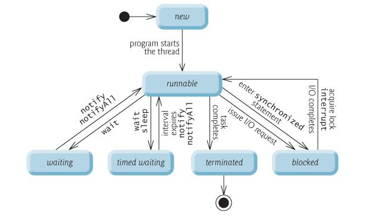

# 最近在看的东西
[Java面试总结](https://github.com/Snailclimb/JavaGuide)

# AQS
什么是AQS？
AQS是AbstractQueuedSynchronizer的缩写，抽象队列同步器。
通过它的名字就大概可以知道它的核心是同步队列，并且是不能直接使用的，一般由子类继承实现不同的功能。

## 总结AQS的基本原理？
AQS实现的基本原理有三点：
1. CAS（比较并交换 compare and swap），由sun.misc.Unsafe类提供。
2. 自旋，本质是有限次尝试，尽可能不进行线程切换。
3. 线程的 park 和 unpark，同样是由sun.misc.Unsafe类提供。 

## CAS
CAS（Compare-and-Swap），即比较并替换，java并发包中许多Atomic的类的底层原理都是CAS。

```java
public final class Unsafe {
    //va1为对象，var2为地址值，var4是要增加的值，var5为当前地址中最新的值
    public final int getAndAddInt(Object var1, long var2, int var4) {
            int var5;
            do {
                var5 = this.getIntVolatile(var1, var2);
            } while(!this.compareAndSwapInt(var1, var2, var5, var5 + var4));
    
            return var5;
    }
}
```
首先通过volatile的可见性，取出当前地址中的值，作为期望值。如果期望值与实际值不符，就一直循环获取期望值，直到set成功。

适用场景：
1. CAS 适合简单对象的操作，比如布尔值、整型值等；
2. CAS 适合冲突较少的情况，如果太多线程在同时自旋，那么长时间循环会导致 CPU 开销很大；

CAS的缺点：
1. CPU开销过大 ： 在并发量比较高的情况下，如果许多线程反复尝试更新某一个变量，却又一直更新不成功，循环往复，会给CPU带来很到的压力。
2. 不能保证代码块的原子性：CAS机制所保证的知识一个变量的原子性操作，而不能保证整个代码块的原子性。比如需要保证3个变量共同进行原子性的更新，就不得不使用synchronized了。
3. ABA问题：如果内存地址V初次读取的值是A，在CAS等待期间它的值曾经被改成了B，后来又被改回为A，那CAS操作就会误认为它从来没有被改变过。

> [CAS机制与自旋锁](https://www.cnblogs.com/dream2true/p/10759763.html)

# 线程的生命周期
线程的生命周期：


线程的几种运行状态：



# 死锁
死锁的四个必要条件：
1. 破坏互斥条件 ：这个条件我们没有办法破坏，因为我们用锁本来就是想让他们互斥的（临界资源需要互斥访问）。
2. 破坏请求与保持条件 ：一次性申请所有的资源。
3. 破坏不剥夺条件 ：占用部分资源的线程进一步申请其他资源时，如果申请不到，可以主动释放它占有的资源。
4. 破坏循环等待条件 ：靠按序申请资源来预防。按某一顺序申请资源，释放资源则反序释放。破坏循环等待条件。

# 什么是跳表？
这个名字很有奇怪，让人感觉很有趣。其实呢，跳表的核心思想就是链表+二分法。
1. 链表：存储元素
2. 二分法：构建出多层，用作索引


> [Java并发容器](https://github.com/Snailclimb/JavaGuide/blob/master/docs/java/Multithread/%E5%B9%B6%E5%8F%91%E5%AE%B9%E5%99%A8%E6%80%BB%E7%BB%93.md)

# ConcurrentLinkedQueue 和 LinkedBlockingQueue 的区别是啥？
Java 提供的线程安全的 Queue 可以分为阻塞队列和非阻塞队列，其中阻塞队列的典型例子是 BlockingQueue，非阻塞队列的典型例子是 ConcurrentLinkedQueue，
在实际应用中要根据实际需要选用阻塞队列或者非阻塞队列。 阻塞队列可以通过加锁来实现，非阻塞队列可以通过 CAS 操作实现。

两者的区别在于：
* ConcurrentLinkedQueue基于CAS的无锁技术，不需要在每个操作时使用锁，所以扩展性表现要更加优异，在常见的多线程访问场景，一般可以提供较高吞吐量。
* LinkedBlockingQueue内部则是基于锁，并提供了BlockingQueue的等待性方法。

换言之，ConcurrentLinkedQueue 是线程安全的 LinkedList 版本，而 LinkedBlockingQueue 是阻塞版的队列，通常用来做生产-消费的容器，提供了阻塞方法。


# Executor 框架
