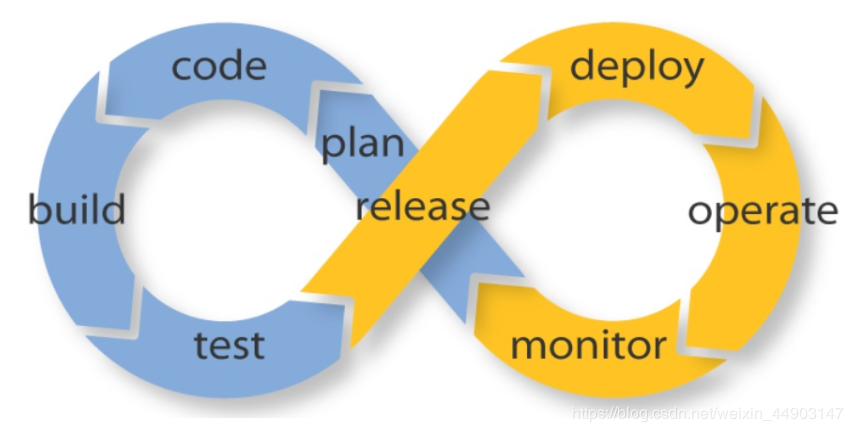

# 云原生
何谓云原生？技术的变革，一定是思想先行，云原生是一种构建和运行应用程序的方法，是一套技术体系和方法论。云原生（CloudNative）是一个组合词，Cloud+Native。
Cloud表示应用程序位于云中，而不是传统的数据中心；Native表示应用程序从设计之初即考虑到云的环境，原生为云而设计，在云上以最佳姿势运行，充分利用和发挥云平台的弹性+分布式优势。

构成云原生的四要素：
1. 容器技术
2. 微服务
3. DevOps
4. 可持续交付

**总而言之，符合云原生架构的应用程序应该是：采用开源堆栈（K8S+Docker）进行容器化，基于微服务架构提高灵活性和可维护性，借助敏捷方法、DevOps支持持续迭代和运维自动化，利用云平台设施实现弹性伸缩、动态调度、优化资源利用率。**

> [什么是云原生？](https://zhuanlan.zhihu.com/p/150190166)

# CI/CD
最初是瀑布模型，后来是敏捷开发，现在是DevOps，这是现代开发人员构建出色的产品的技术路线。随着DevOps的兴起，出现了持续集成（Continuous Integration）、持续交付（Continuous Delivery） 、持续部署（Continuous Deployment） 的新方法。

* **持续集成**的重点是将各个开发人员的工作集合到一个代码仓库中。通常，每天都要进行几次，主要目的是尽早发现集成错误，使团队更加紧密结合，更好地协作。
* **持续交付**的目的是最小化部署或释放过程中固有的摩擦。它的实现通常能够将构建部署的每个步骤自动化，以便任何时刻能够安全地完成代码发布（理想情况下）。
* **持续部署**是一种更高程度的自动化，无论何时对代码进行重大更改，都会自动进行构建/部署。

# 容器化
Docker是应用最为广泛的容器引擎，在思科谷歌等公司的基础设施中大量使用，是基于LXC技术搞的，容器化为微服务提供实施保障，起到应用隔离作用，K8S是容器编排系统，用于容器管理，容器间的负载均衡，谷歌搞的，Docker和K8S都采用Go编写，都是好东西。

# DevOps
这是个组合词，Dev+Ops，就是开发和运维合体，不像开发和产品，经常刀刃相见，实际上DevOps应该还包括测试，DevOps是一个敏捷思维，是一个沟通文化，也是组织形式，为云原生提供持续交付能力。

# 微服务
几乎每个云原生的定义都包含微服务，跟微服务相对的是单体应用，微服务有理论基础，那就是康威定律，指导服务怎么切分，很玄乎，凡是能称为理论定律的都简单明白不了，不然就忒没b格，大概意思是组织架构决定产品形态，不知道跟马克思的生产关系影响生产力有无关系。
微服务架构的好处就是按function切了之后，服务解耦，内聚更强，变更更易；另一个划分服务的技巧据说是依据DDD来搞。

# 分布式
集群是个物理形态，分布式是个工作方式。

分布式结构就是将一个完整的系统，按照业务功能，拆分成一个个独立的子系统，在分布式结构中，每个子系统就被称为“服务”。这些子系统能够独立运行在web容器中，它们之间通过RPC方式通信。

* 分布式：distributed
* 集群：cluster

所以，你可以看到，集群主要描述了一个集合，一些相似的东西，提供相似的功能，这个就叫做集群。而分布式，主要是将一个东西，分发给一堆相似的内容或东西。
集群描述了受众的状态，也就是处理机不是单一体，是一个相似的个体组成的群体。分布式描述了源头的处理方式，是将单一源分发给多个处理机，而非单一处理机进行处理。
当我们讲一个集群，我们着重描述这个处理机的静态状态，强调个体和群体之间的联系。当我们讲分布式系统，我们着重讲这个处理机的动态状态，强调请求和处理直接的分发状况

# IaaS
IaaS（Infrastructure as a Service），即基础设施即服务。指把IT基础设施作为一种服务通过网络对外提供，并根据用户对资源的实际使用量或占用量进行计费的一种服务模式。
在这种服务模型中，普通用户不用自己构建一个数据中心等硬件设施，而是通过租用的方式，利用 Internet从IaaS服务提供商获得计算机基础设施服务，包括服务器、存储和网络等服务。
特点：
1. 租赁
2. 自助服务
3. 动态缩放
4. 服务等级
5. 许可
6. 计量

# PaaS
PaaS是（Platform as a Service）的缩写，是指平台即服务。 把服务器平台作为一种服务提供的商业模式，通过网络进行程序提供的服务称之为SaaS(Software as a Service)，
而云计算时代相应的服务器平台或者开发环境作为服务进行提供就成为了PaaS(Platform as a Service)。

# SaaS
SaaS，是Software-as-a-Service的缩写名称，意思为软件即服务，即通过网络提供软件服务。
SaaS平台供应商将应用软件统一部署在自己的服务器上，客户可以根据工作实际需求，通过互联网向厂商定购所需的应用软件服务，按定购的服务多少和时间长短向厂商支付费用，并通过互联网获得Saas平台供应商提供的服务。

# Kubernetes

# ETCD

# eureka

# jenkins

# 云计算

# 大数据

# 中台

# SLA

# prometheus