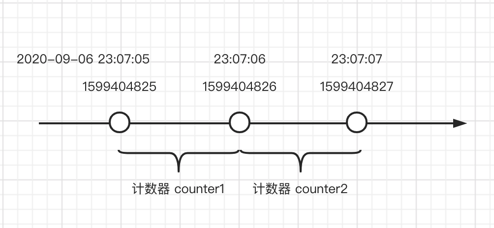
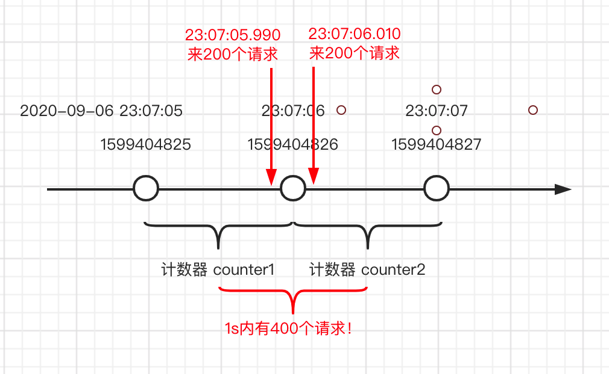
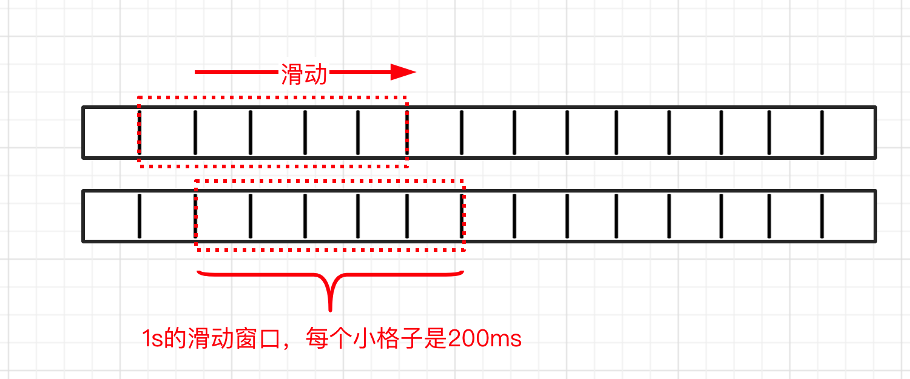
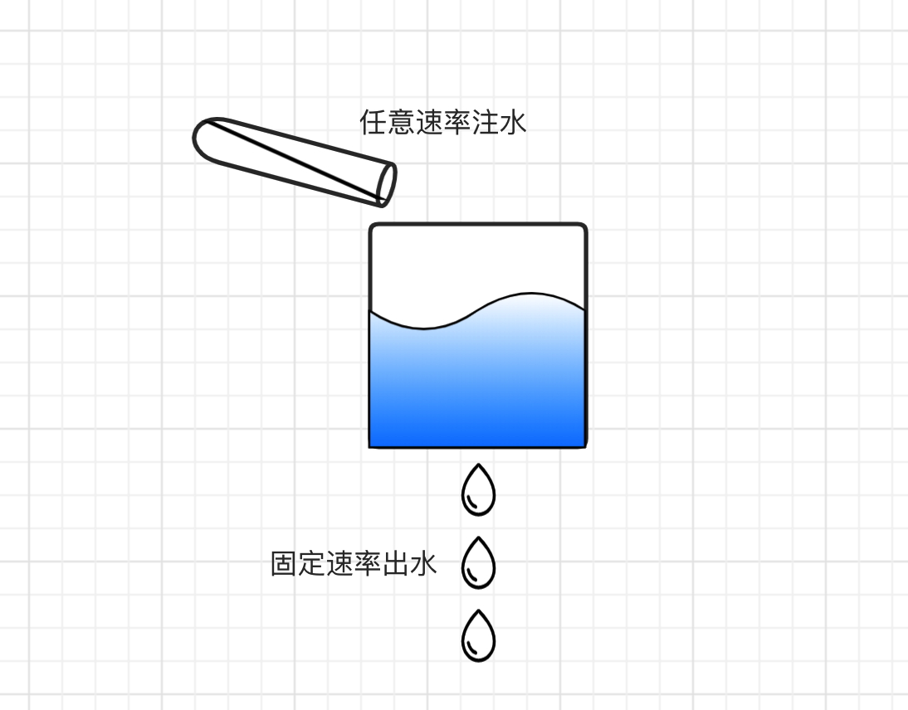
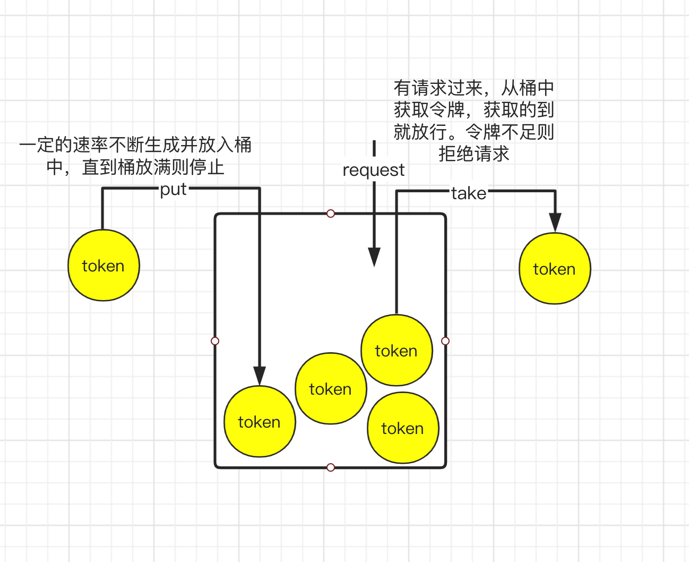

# 高可用保障之限流

## 前言
限流 —— 顾名思义就是流量限制，它是高可用保障的一种机制。

限流要能对流量的大小做限制，还要能根据流量的某些特征做限制。当然，对于普通的服务端来说，能限制请求流量不超过服务可承受的最大阈值，让系统在一个合理的负载下工作就可以了。特征限流、限频这种更灵活、更具业务属性的限制操作，可以被归纳到反爬系统中去。

在这里，我们介绍的限流主要是对 **流量大小** 限制的解决方案。

## 为什么要限流？
为什么要限流？我们都知道一个服务能承受的负载是有限的，如果请求过来的流量接近服务能承受的最大值，这个时候服务的响应就会开始变得不可控，可能是响应时间过高，也可能是错误率上升。再大点流量的话，服务可能就直接不可用了。

因此，我们需要做限流。通过压测，我们能对服务进行 **流量探顶**，再将探测到的最大流量设置为 **限流阈值**，超过了这个阈值就把后来的请求给拒绝掉，保证服务可用。

## 常见的限流算法有哪些？
因为限流判断是在执行业务功能之前，每一次请求都需要先走限流逻辑，所以限流算法就是要做到精准、高效、可用，且尽可能的降低耗时，让业务无感知。

下面我们来介绍几种常见的限流算法：

### 1. 计数器（固定窗口）算法
计数器算法原理很简单，在指定的时间周期内累加访问次数，如果访问次数超过了设定的阈值，则拒绝该周期内的后续流量。
例如，要限制qps=200。我们就需要将窗口的大小设置为1s，第一个请求过来的时间作为窗口开始时间，在窗口时间内有请求过来，内置的计数器就加1，直到计数超过限流阈值200，超过后就将后续的请求拒绝掉。
请求时间超过窗口结束时间则重置计数器，开始新一轮的计数。

计数器算法示意图如下：

计数器算法很简单，但也存在一个比较明显的问题 —— 临界问题。如果有恶意用户分别在两个相邻窗口的结束时间和开始时间瞬间发起大量请求。
计数器算法是会放过限流阈值近两倍的流量的，这样的情况下服务可能会被冲垮。临界攻击示意图如下：

### 2. 滑动窗口算法
仔细观察计数器算法其实不难发现，临界问题的根因在于窗口粒度太粗，如果我们能把窗口缩小，1s分成多个统计窗口就能解决临界问题。
于是，我们在固定窗口的基础上加以改进，便有了滑动窗口算法。

可以看到，滑动窗口把1s分成了5个200ms的小窗口（可以把每个小窗口看作一个计数器）。由于统计精度的提高，临界问题便能解决。
因此，当滑动的格子个数越多，滚动就越平滑，限流也就越精确。但相应的内存占用会越大。

### 3. 漏桶算法

### 4. 令牌桶算法

## 业界的限流方案和轮子

### 1. Netflix Hystrix

### 2. Alibaba Sentinel

## 工作中接触到的限流方案

### 1. 猫眼 MovieOceanus

### 2. 美团 Rhino

## 遇到的难点

### 集群精准限流怎么做？
