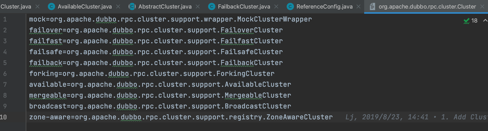
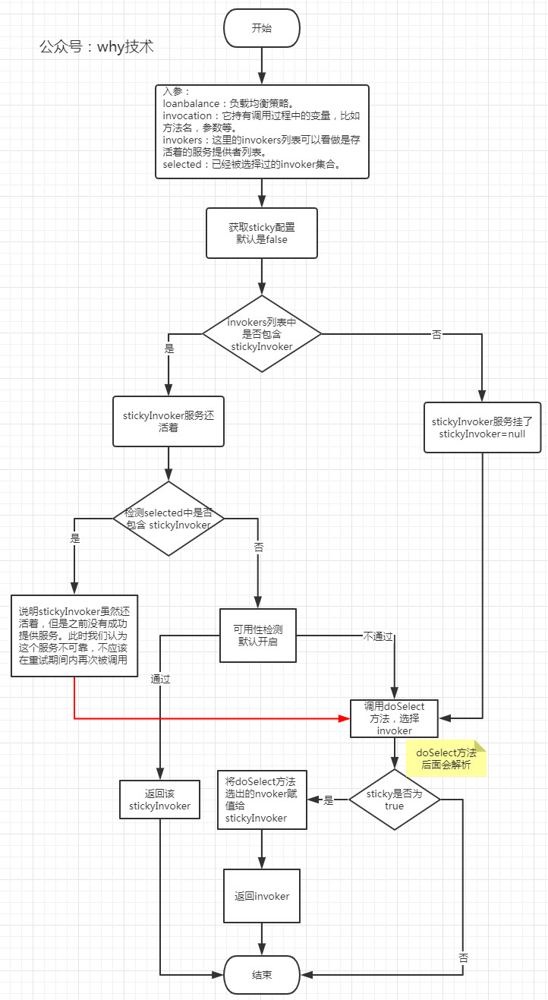
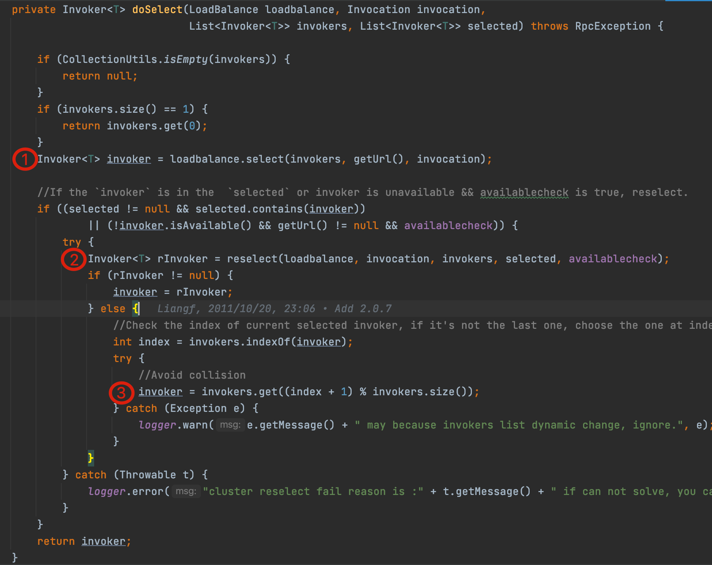

# Cluster的集群容错机制
## Cluster的作用是什么？
Cluster是消费端的概念，对于一次请求，作为消费者到底调用哪个提供者呢？服务调用失败的时候我怎么做呢？是重试？是抛出异常？或者仅仅是打印出异常？

为了处理这些问题，Dubbo定义了集群接口Cluster以及Cluster Invoker。

**集群模块是服务提供者和服务消费者的中间层，为服务消费者屏蔽了服务提供者的情况，这样服务消费者就可以专心处理远程调用相关事宜。比如发请求，接受服务提供者返回的数据等。这就是Dubbo Cluster集群的作用。**

## Cluster集群容错相关的组件
在对集群相关代码进行分析之前，这里有必要先来介绍一下集群容错的所有组件。包含 Cluster、Cluster Invoker、Directory、Router 和 LoadBalance 等。

集群工作过程可分为两个阶段：

* 第一个阶段是在服务消费者初始化期间，集群 Cluster 实现类为服务消费者创建 Cluster Invoker 实例，即上图中的 merge 操作。
* 第二个阶段是在服务消费者进行远程调用时。

## 集群容错方式
**Cluster的十种实现：**

**集群容错相关的有6个实现：**

* Failover Cluster - 失败自动切换：失败自动切换，在调用失败时，失败自动切换，当出现失败，重试其它服务器。通常用于读操作，但重试会带来更长延迟。可通过retries="2"来设置重试次数(不含第一次)。
* Failfast Cluster - 快速失败：快速失败，只发起一次调用，失败立即报错。通常用于非幂等性的写操作，比如新增记录。
* Failsafe Cluster - 失败安全：失败安全，出现异常时，直接忽略。通常用于写入审计日志等操作。
* Failback Cluster - 失败自动恢复：失败自动恢复，后台记录失败请求，定时重发。通常用于消息通知操作。
* Forking Cluster - 并行调用多个服务提供者：并行调用多个服务器，只要一个成功即返回。通常用于实时性要求较高的读操作，但需要浪费更多服务资源。可通过 forks="2" 来设置最大并行数。
* Broadcast Cluster - 广播调用所有服务提供者：广播调用所有提供者，逐个调用，任意一台报错则报错。通常用于通知所有提供者更新缓存或日志等本地资源信息。

**其他实现有4个：**

* Available Cluster - 获取可用的服务方。遍历所有Invokers通过invoker.isAvalible判断服务端是否活着，只要一个有为true，直接调用返回，不管成不成功。
* Mergeable Cluster - 分组聚合，将集群中的调用结果聚合起来，然后再返回结果。比如菜单服务，接口一样，但有多种实现，用group区分，现在消费方需从每种group中调用一次返回结果，合并结果返回，这样就可以实现聚合菜单项。
* Mock Cluster - 本地伪装，通常用于服务降级，比如某验权服务，当服务提供方全部挂掉后，客户端不抛出异常，而是通过 Mock 数据返回授权失败。
* ZoneAware Cluster - 对于多注册中心订阅的场景，选址时的多了一层注册中心集群间的负载均衡。

## Dubbo的粘滞连接
***粘滞连接用于有状态服务，尽可能的让客户端总是向同一服务提供者发起服务调用，除非这台机器挂了，再选择另一台。***

Loadbalance的select方法主要支持了粘滞连接的功能，默认情况下粘滞连接是关闭状态。当粘滞连接开启时，默认会进行可用性检查。

粘滞连接运行流程介绍：

Failover Cluster选择出一个可用的Invoker最多要进行三次选择，也是doSelect的主要逻辑，三次分别是（图中标号了①②③的地方）：

①：通过负载均衡组件选择 Invoker。

②：如果选出来的 Invoker 不稳定，或不可用，此时需要调用reselect 方法进行重选。

③：reselect选出来的Invoker为空，此时定位invoker在invokers列表中的位置index，然后获取index+1处的 invoker。

## 参考
> [Dubbo集群容错](https://dubbo.apache.org/zh/docs/v2.7/dev/source/cluster/)
> [Dubbo Cluster集群那点你不知道的事](https://segmentfault.com/a/1190000021719538)

